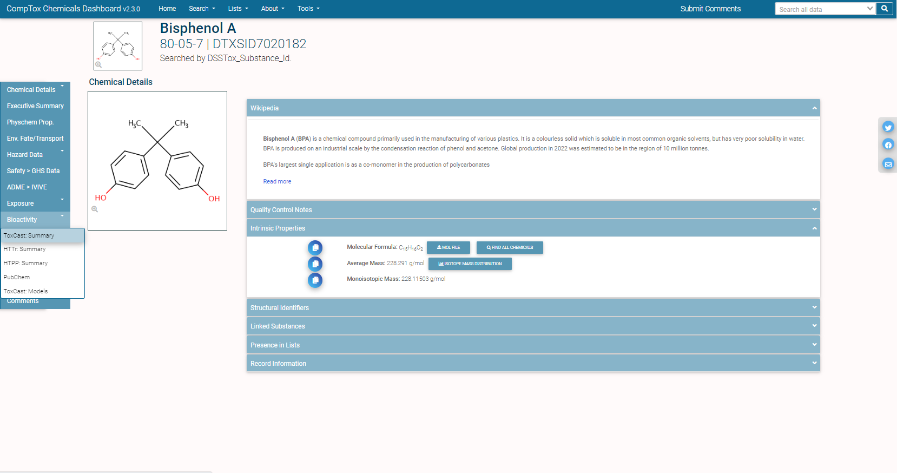
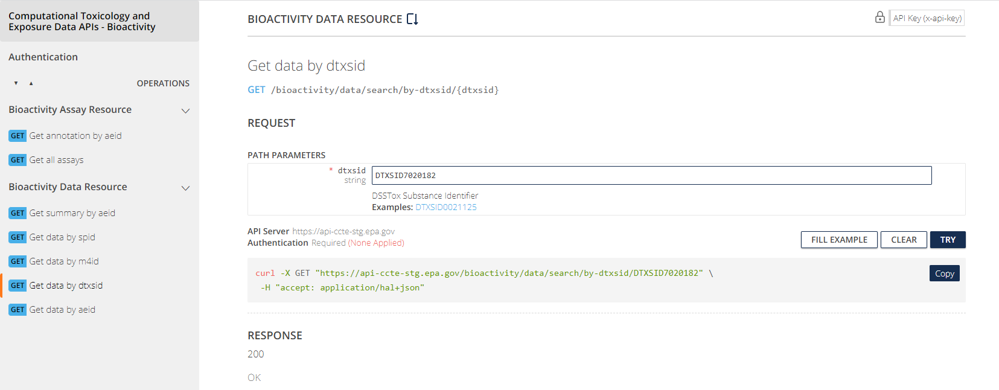

```{r, include = FALSE}
knitr::opts_chunk$set(
  collapse = TRUE,
  comment = "#>"
)
library(httptest)
start_vignette("6")
```

```{r setup, echo=FALSE, results='hide', warning=FALSE}
if (!library(ccdR, logical.return = TRUE)){
  devtools::load_all()
}
```

```{r setup-print, echo = FALSE}
# Redefining the knit_print method to truncate character values to 25 characters
# in each column and to truncate the columns in the print call to prevent 
# wrapping tables with several columns.
#library(ccdR)
knit_print.data.table = function(x, ...) {
  y <- data.table::copy(x)
  y <- y[, lapply(.SD, function(t){
    if (is.character(t)){
      t <- strtrim(t, 25)
    }
    return(t)
  })]
  print(y, trunc.cols = TRUE)
}

registerS3method(
  "knit_print", "data.table", knit_print.data.table,
  envir = asNamespace("knitr")
)

# Remove this once Bioactivity goes public
stg_bioactivity_server <- 'https://api-ccte-stg.epa.gov/bioactivity/data'
```


## Introduction

In this vignette, we will explore the `Bioactivity` domain of endpoints found in the [CCTE API Bioactivity Endpoints](https://api-ccte.epa.gov/docs/bioactivity.html). Before getting started, we need to provide an API key to access the endpoints.

### Setting, using, and storing the API key

We store the API key required to access the APIs. To do this for the current session, run the first command. If you want to store your key across multiple sessions, run the second command.

```{r, eval=FALSE}
# This stores the key in the current session
register_ccdr(key = '<YOUR API KEY>')

# This stores the key across multiple sessions and only needs to be run once. 
# If the key changes, rerun this with the new key.
register_ccdr(key = '<YOUR API KEY>', write = TRUE)
```

To check that your key has successfully been stored for the session, run the following command.

```{r, eval=FALSE}
ccte_key()
```

After registering your API key, the functions in *ccdR* will automatically access the API key you saved without requiring you to input it as a function parameter each time you call a function.

## Bioactivity Resource

### Comparing Bioactivity Data associated to Two Important Environmental Contaminant Lists

We study two different data sets contained in the [CompTox Chemicals Dashboard](https://comptox.epa.gov/dashboard/)(CCD) and observe how they relate and how they differ. The two data sets that we will explore are a water contaminant priority list and an air toxics list.  

The fourth Drinking Water Contaminant Candidate List (CCL4) is a set of chemicals that "...are not subject to any proposed or promulgated national primary drinking water regulations, but are known or anticipated to occur in public water systems...." Moreover, this list "...was announced on November 17, 2016. The CCL 4 includes 97 chemicals or chemical groups and 12 microbial contaminants...." The National-Scale Air Toxics Assessments (NATA) is "... EPA's ongoing comprehensive evaluation of air toxics in the United States... a state-of-the-science screening tool for State/Local/Tribal agencies to prioritize pollutants, emission sources and locations of interest for further study in order to gain a better understanding of risks... use general information about sources to develop estimates of risks which are more likely to overestimate impacts than underestimate them...."  

These lists can be found in the CCD at [CCL4](https://comptox.epa.gov/dashboard/chemical-lists/CCL4) with additional information at [CCL4 information](https://www.epa.gov/ccl/contaminant-candidate-list-4-ccl-4-0) and [NATADB](https://comptox.epa.gov/dashboard/chemical-lists/NATADB) with additional information at [NATA information](https://www.epa.gov/national-air-toxics-assessment). The quotes from the previous paragraph were excerpted from list detail descriptions found using the CCD links.

We explore details about these two lists of chemicals before diving into analyzing the data contained in each list.

```{r}
options(width = 100)
ccl4_information <- get_public_chemical_list_by_name('CCL4')
print(ccl4_information, trunc.cols = TRUE)

natadb_information <- get_public_chemical_list_by_name('NATADB')
print(natadb_information, trunc.cols = TRUE)
```

Now we pull the actual chemicals contained in the lists using the APIs.

```{r}
ccl4 <- get_chemicals_in_list('ccl4')
ccl4 <- data.table::as.data.table(ccl4)

natadb <- get_chemicals_in_list('NATADB')
natadb <- data.table::as.data.table(natadb)
```

### Accessing and analyzing bioactivity data

Using the standard CompTox Chemicals Dashboard approach to access bioactivity, one would again navigate to the individual chemical page. 

```{r, echo = FALSE, out.width = "90%", fig.align='center', fig.cap="Fig 1: CompTox Chemicals Dashboard Genotoxicity"}

```

Once one navigates to the bioactivity tab highlighted in the previous page, the following is displayed as seen in Figure 2 and 3.

```{r, echo = FALSE, out.width = "90%", fig.align='center', fig.cap="Fig 2: CompTox Chemicals Dashboard BPA Genotoxicity"}
knitr::include_graphics("./Pictures/CCD_BPA_Bioactivity_ToxCast_TOP.png")
```

```{r, echo = FALSE, out.width = "90%", fig.align='center', fig.cap="Fig 3: CompTox Chemicals Dashboard BPA Genotoxicity"}
knitr::include_graphics("./Pictures/CCD_BPA_Bioactivity_ToxCast_BOTTOM.png")
```

This page includes two sets of information, the first of which provides a visual representation of the bioactivity data available while the second provides a summary of available bioactivity data and associated data of the studies and sources.

We again use the CCTE APIs to streamline the process of retrieving this information in a programmatic fashion. To this end, we will use the endpoints found within the `Bioactivity` endpoints of the CCTE APIs. Pictured below in Figure 4 is the particular set of bioactivity resources available in the `Bioactivity` endpoints of the CCTE APIs.

```{r, echo = FALSE, out.width = "90%", fig.align='center', fig.cap="Fig 4: CCTE APIs Bioactivity endpoint resources"}

```


First, we will access the bioactivity data associated to a single chemical before starting an analysis of the two chemical lists CCL4 and NATADB. We explore the data associated with Bisphenol A (BPA).

```{r}
bpa_bioactivity <- get_bioactivity_details(DTXSID = 'DTXSID7020182', Server = stg_bioactivity_server)
bpa_bioactivity <- data.table::as.data.table(bpa_bioactivity)

head(bpa_bioactivity)
```

We examine the dimensions and the column names.

```{r}
dim(bpa_bioactivity)
names(bpa_bioactivity)
```


We first determine the `aeid` values associated with BPA and then determine the number of data points for each `aeid`.

```{r}
sort(bpa_bioactivity[, unique(aeid)])

bpa_bioactivity[, .(Number = .N), by = .(aeid)][order(-Number, aeid),]
```

Observe that the assay with `aeid` value 2037 is the most represented assay. To learn more about this assay, we retrieve the associated assay information.

```{r}
assay_2037 <- get_annotation_by_aeid(AEID = 2037, Server = 'https://api-ccte-stg.epa.gov/bioactivity')
assay_2037 <- data.table::as.data.table(assay_2037)

head(assay_2037)
```

We can then determine which chemicals have results that correspond to this particular assay.

```{r}
assay_2037_data <- get_bioactivity_details(AEID = 2037, Server = stg_bioactivity_server)
assay_2037_data <- data.table::as.data.table(assay_2037_data)

head(assay_2037_data)
```

Let us now look at which chemicals from each data set have assay data associated to `aeid` value 2037.

```{r}
ccl4_2037 <- intersect(ccl4$dtxsid, assay_2037_data$dtxsid)
natadb_2037 <- intersect(natadb$dtxsid, assay_2037_data$dtxsid)

ccl4_2037
natadb_2037
```
We do the following search to determine the assay results for chemicals in each of CCL4 and NATADB that have assay `aeid` value 2037.

```{r}
ccl4_2037 <- assay_2037_data[dtxsid %in% ccl4_2037, ][order(dtxsid), ]
natadb_2037 <- assay_2037_data[dtxsid %in% natadb_2037, ][order(dtxsid), ]
```

We calculate the mean `ac50` value for the associated data and grouped by chemical.

```{r}
ccl4_2037[!is.na(ac50), .(Mean_AC50 = mean(ac50))]
ccl4_2037[!is.na(ac50), .(Mean_AC50 = mean(ac50)), by = .(dtxsid)][order(-Mean_AC50),]

natadb_2037[!is.na(ac50), .(Mean_AC50 = mean(ac50))]
natadb_2037[!is.na(ac50), .(Mean_AC50 = mean(ac50)), by = .(dtxsid)][order(-Mean_AC50),]
```

From this we observe that the average `ac50` values of the chemicals in CCL4 that have assay data for `aeid` 2037 is 20.38932 while for NATADB it is 37.8065. The maximum `ac50` values for CCL4 chemicals is 50, shared by the four chemicals identified by DTXSID0021464, DTXSID4022361, DTXSID9032113, and DTXSID5020576 while for NATADB the max value if 90.59979 given by the chemical identified by DTXSID9020299. For CCL4, the minimum `ac50` value for this set of chemicals is 0.4138751 given by the chemical identified by DTXSID8031865 and for NATADB is 4.67915 given by the chemical identified by DTXSID4021395.

We look at the same assay result for BPA to compared the values we just calculated.

```{r}
bpa_bioactivity[aeid %in% 2037, .(Mean_AC50 = mean(ac50))]
```

From this, we see that the average `ac50` value for `aeid` value 2037 Assay data for CCL4 chemicals is distributed above and below that of BPA in equal quantity, while for NATADB chemicals, all but two of 13 are higher. 


## Conclusion

In this vignette, we explored a variety of functions that access different types of data found in the `Bioactivity` endpoints of the CCTE APIs. While this exploration was not exhaustive, it provides a basic introduction to how one may access data and work with it. Additional endpoints and corresponding functions exist and we encourage the user to explore these while keeping in mind the examples contained in this vignette.

```{r breakdown, echo = FALSE, results = 'hide'}
# This chunk will be hidden in the final product. It serves to undo defining the
# custom print function to prevent unexpected behavior after this module during
# the final knitting process

knit_print.data.table = knitr::normal_print
  
registerS3method(
  "knit_print", "data.table", knit_print.data.table,
  envir = asNamespace("knitr")
)
```

```{r, include=FALSE}
end_vignette()
```
