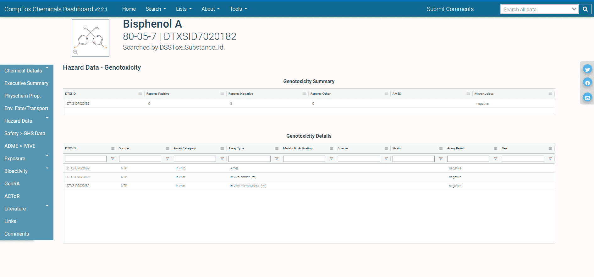

```{r, include = FALSE}
knitr::opts_chunk$set(
  collapse = TRUE,
  comment = "#>"
)
library(httptest)
start_vignette("5")
```

```{r setup, echo=FALSE, results='hide', warning=FALSE}
if (!library(ccdR, logical.return = TRUE)){
  devtools::load_all()
}
```

```{r setup-print, echo = FALSE}
# Redefining the knit_print method to truncate character values to 25 characters
# in each column and to truncate the columns in the print call to prevent 
# wrapping tables with several columns.
#library(ccdR)
knit_print.data.table = function(x, ...) {
  y <- data.table::copy(x)
  y <- y[, lapply(.SD, function(t){
    if (is.character(t)){
      t <- strtrim(t, 25)
    }
    return(t)
  })]
  print(y, trunc.cols = TRUE)
}

registerS3method(
  "knit_print", "data.table", knit_print.data.table,
  envir = asNamespace("knitr")
)
```


## Introduction

In this vignette, we will explore the `Hazard` domain of endpoints found in the [CCTE API Hazard Endpoints](https://api-ccte.epa.gov/docs/hazard.html). Before getting started, we need to provide an API key to access the endpoints.

### Setting, using, and storing the API key

We store the API key required to access the APIs. To do this for the current session, run the first command. If you want to store your key across multiple sessions, run the second command.

```{r, eval=FALSE}
# This stores the key in the current session
register_ccdr(key = '<YOUR API KEY>')

# This stores the key across multiple sessions and only needs to be run once. 
# If the key changes, rerun this with the new key.
register_ccdr(key = '<YOUR API KEY>', write = TRUE)
```

To check that your key has successfully been stored for the session, run the following command.

```{r, eval=FALSE}
ccte_key()
```

After registering your API key, the functions in *ccdR* will automatically access the API key you saved without requiring you to input it as a function parameter each time you call a function.

## Hazard Resource

### Comparing Hazard Data associated to Two Important Environmental Contaminant Lists

We study two different data sets contained in the [CompTox Chemicals Dashboard](https://comptox.epa.gov/dashboard/)(CCD) and observe how they relate and how they differ. The two data sets that we will explore are a water contaminant priority list and an air toxics list.  

The fourth Drinking Water Contaminant Candidate List (CCL4) is a set of chemicals that "...are not subject to any proposed or promulgated national primary drinking water regulations, but are known or anticipated to occur in public water systems...." Moreover, this list "...was announced on November 17, 2016. The CCL 4 includes 97 chemicals or chemical groups and 12 microbial contaminants...." The National-Scale Air Toxics Assessments (NATA) is "... EPA's ongoing comprehensive evaluation of air toxics in the United States... a state-of-the-science screening tool for State/Local/Tribal agencies to prioritize pollutants, emission sources and locations of interest for further study in order to gain a better understanding of risks... use general information about sources to develop estimates of risks which are more likely to overestimate impacts than underestimate them...."  

These lists can be found in the CCD at [CCL4](https://comptox.epa.gov/dashboard/chemical-lists/CCL4) with additional information at [CCL4 information](https://www.epa.gov/ccl/contaminant-candidate-list-4-ccl-4-0) and [NATADB](https://comptox.epa.gov/dashboard/chemical-lists/NATADB) with additional information at [NATA information](https://www.epa.gov/national-air-toxics-assessment). The quotes from the previous paragraph were excerpted from list detail descriptions found using the CCD links.

We explore details about these two lists of chemicals before diving into analyzing the data contained in each list.

```{r}
options(width = 100)
ccl4_information <- get_public_chemical_list_by_name('CCL4')
print(ccl4_information, trunc.cols = TRUE)

natadb_information <- get_public_chemical_list_by_name('NATADB')
print(natadb_information, trunc.cols = TRUE)
```

Now we pull the actual chemicals contained in the lists using the APIs.

```{r}
ccl4 <- get_chemicals_in_list('ccl4')
ccl4 <- data.table::as.data.table(ccl4)

natadb <- get_chemicals_in_list('NATADB')
natadb <- data.table::as.data.table(natadb)
```

### Accessing and analyzing genotoxicity data

Using the standard CompTox Chemicals Dashboard approach to access genotoxicity hazard data, one would again navigate to the individual chemical page. 

```{r, echo = FALSE, out.width = "90%", fig.align='center', fig.cap="Fig 1: CompTox Chemicals Dashboard Hazard"}
knitr::include_graphics("./Pictures/BPA_Hazard_data_-_Genotoxicity.png")
```

Once one navigates to the genotoxicity portion of the hazard tab highlighted in the previous page, the following is displayed as seen in Figure 2.

```{r, echo = FALSE, out.width = "90%", fig.align='center', fig.cap="Fig 2: CompTox Chemicals Dashboard BPA Hazard Data - Genotoxicity"}

```

This page includes two sets of information, the first of which provides a summary of available genotoxicity data while the second provides the individual reports and samples of such data.

We again use the CCTE APIs to streamline the process of retrieving this information in a programmatic fashion. To this end, we will use the genotoxicity endpoints found within the `Hazard` endpoints of the CCTE APIs. Pictured below in Figure 3 is the particular set of genotoxicity resources available in the `Hazard` endpoints of the CCTE APIs.

```{r, echo = FALSE, out.width = "90%", fig.align='center', fig.cap="Fig 3: CCTE APIs Hazard endpoint genotoxicity resources"}
knitr::include_graphics("./Pictures/Hazard_-_genotoxicity_resource.png")
```

There are both summary and detail resources, reflecting the information one can find on the CompTox Chemicals Dashboard Genotoxicity page for a given chemical.

To access the genetox endpoint, we will use the function `get_genetox_summary()`. Since we have a list of chemicals, rather than searching individually for each chemical, we use the batch search version of the function, named `get_genetox_summary_batch()`. We will examine this and then access the details.

Grab the data using the APIs.
```{r}
ccl4_genotox <- get_genetox_summary_batch(DTXSID = ccl4$dtxsid)
natadb_genetox <- get_genetox_summary_batch(DTXSID = natadb$dtxsid)
```

Examine the dimensions.

```{r}
dim(ccl4_genotox)
dim(natadb_genetox)
```

Examine the column names and data from the first six chemicals with genetox data from CCL4.

```{r}
colnames(ccl4_genotox)
head(ccl4_genotox)
```

The information returned is of the first variety highlighted in the Figure 2, that is, summary data on the available genotoxicity data for each chemical.

Observe that we have information on 71 chemicals from the CCL4 data and 153 from the NATA data. We note the chemicals not included in the results and then dig into the returned results.

```{r}
ccl4[!(dtxsid %in% ccl4_genotox$dtxsid), 
     .(dtxsid, casrn, preferredName, molFormula)]
natadb[!(dtxsid %in% natadb_genetox$dtxsid), 
       .(dtxsid, casrn, preferredName, molFormula)]
```

Now, we access the genotoxicity details of the chemicals in each data set using the function `get_genetox_details_batch()`. We explore the dimensions of the returned queries, the column names, and the first few lines of the data.

Grab the data from the CCTE APIs.

```{r}
ccl4_genetox_details <- get_genetox_details_batch(DTXSID = ccl4$dtxsid)
natadb_genetox_details <- get_genetox_details_batch(DTXSID = natadb$dtxsid)
```

Examine the dimensions.

```{r}
dim(ccl4_genetox_details)
dim(natadb_genetox_details)
```

Look at the column names and the first six rows of the data from the CCL4 chemicals.

```{r}
colnames(ccl4_genetox_details)
head(ccl4_genetox_details)
```

We examine the information returned for the first chemical in each set of results, which is DTXSID0020153. Notice that the information is identical in each case as this information is chemical specific and not data set specific.

Look at the dimensions first.

```{r}
dim(ccl4_genetox_details[dtxsid %in% 'DTXSID0020153', ])
dim(natadb_genetox_details[dtxsid %in% 'DTXSID0020153', ])
```

Now examine the first few rows.

```{r}
head(ccl4_genetox_details[dtxsid %in% 'DTXSID0020153', ])
```

Observe that the data is the same for each data set when restricting to the same chemical. This is because the information we are retrieving is specific to the chemical and not dependent on the chemical lists to which the chemical may belong.

```{r}
identical(ccl4_genetox_details[dtxsid %in% 'DTXSID0020153', ], 
          natadb_genetox_details[dtxsid %in% 'DTXSID0020153', ])
```


We now explore the assays present for chemicals in each data set. We first determine the unique values of the `assayCategory` column and then group by these values and determine the number of unique assays for each `assayCategory` value.

Determine the unique assay categories.

```{r}
ccl4_genetox_details[, unique(assayCategory)]
natadb_genetox_details[, unique(assayCategory)]
```
Determine the unique assays for each data set and list them.

```{r}
ccl4_genetox_details[, unique(assayType)]

natadb_genetox_details[, unique(assayType)]
```


Determine the number of assays per unique `assayCategory` value.

```{r}
ccl4_genetox_details[, .(Assays = length(unique(assayType))), 
                     by = .(assayCategory)]

natadb_genetox_details[, .(Assays = length(unique(assayType))),
                       by = .(assayCategory)]
```


We can analyze these results more closely, counting the number of assay results and grouping by `assayCategory`, and `assayType`. We also examine the different numbers of `assayCategory` and `assayTypes` values used.

```{r}
ccl4_genetox_details[, .N, by = .(assayCategory, assayType, assayResult)]
ccl4_genetox_details[, .N, by = .(assayCategory)]
```

We look at the `assayType` values and numbers of each for the three different `assayCategory` values.

```{r}
ccl4_genetox_details[assayCategory == 'in vitro', .N, by = .(assayType)]
ccl4_genetox_details[assayCategory == 'ND', .N, by = .(assayType)]
ccl4_genetox_details[assayCategory == 'in vivo', .N, by = .(assayType)]
```

Now we repeat this for NATADB.

```{r}
natadb_genetox_details[, .N, by = .(assayCategory, assayType, assayResult)]
natadb_genetox_details[, .N, by = .(assayCategory)]
```

Examine the number of rows for each `assayType` value by each `assaycategory` value.

```{r, R.options=list(width=150) }
natadb_genetox_details[assayCategory == 'in vitro', .N, by = .(assayType)]
natadb_genetox_details[assayCategory == 'ND', .N, by = .(assayType)]
natadb_genetox_details[assayCategory == 'in vivo', .N, by = .(assayType)]
```

From this work, observe that there are 90 unique assays for CCl4 and 114 unique assays for NATADB. The different assay categories are "in vitro", "ND", and "in vivo", with 65 unique "in vitro" assays for CCl4 and 83 for NATADB, 3 unique "ND" assays for CCL4 and 3 for NATADB, and 22 unique "in vivo" assays for CCL4 and 28 for NATADB.


Next, we dig into the results of the assays. One may be interested in looking at the number of chemicals for which an assay resulted in a positive or negative result for instance. We group by `assayResult` and determine the number of unique `dtxsid` values associated with each `assayResult` value.

```{r}
ccl4_genetox_details[, .(DTXSIDs = length(unique(dtxsid))), by = .(assayResult)]
natadb_genetox_details[, .(DTXSIDs = length(unique(dtxsid))), 
                       by = .(assayResult)]
```

For CCL4, there are 64 unique chemicals that have a negative assay result, 53 that have a positive result, and 15 that have an equivocal result. For NATADB, there are 141 unique chemicals that have a negative assay result, 130 that have a positive result, and 48 that have an equivocal result. Observe that since there are 72 unique `dtxsid` values with assay results in CCL4 and 153 in NATADB, there are several chemicals that have multiple assay results.

We now determine the chemicals from each data set that are known to have genotoxic effects. For this, we look to see which chemicals produce at least one positive response in the `assayResult` column.

```{r}
ccl4_genetox_details[, .(is_positive = any(assayResult == 'positive')), 
                     by = .(dtxsid)][is_positive == TRUE, dtxsid]
natadb_genetox_details[, .(is_positive = any(assayResult == 'positive')),
                       by = .(dtxsid)][is_positive == TRUE, dtxsid]
```

With so much genotoxicity data, let us explore this data for one chemical more deeply to get a sense of the assays and results present for it. We will explore the chemical with DTXSID0020153. We will look at the assays, the number of each type of result, and which correspond to "positive" results. To determine this, we group by `assayResult` and calculate `.N` for each group. We also isolate which were positive and output a data.table with the number of each type.

```{r}
ccl4_genetox_details[dtxsid == 'DTXSID0020153', .(Number = .N), 
                     by = .(assayResult)]
ccl4_genetox_details[dtxsid == 'DTXSID0020153' & assayResult == 'positive', 
                     .(Number_of_assays = .N), by = .(assayType)][order(-Number_of_assays),]
```


There were five assays that produced a negative result, 22 that produced a positive result, and one that produced an equivocal result. Of the 22 positive assays, "bacterial reverse mutation assay" and "Ames" were the most numerous, with three each.

## Exploring additional hazard data


Next, we examine the hazard data associated with the chemicals in each data set. For each chemical, there will be potentially hundreds of rows of hazard data, so the returned results will be much larger than in most other API endpoints.

```{r}
ccl4_hazard <- get_hazard_by_dtxsid_batch(DTXSID = ccl4$dtxsid)
natadb_hazard <- get_hazard_by_dtxsid_batch(DTXSID = natadb$dtxsid)
```

We do some preliminary exploration of the data. First we determine the dimensions of the data sets.

```{r}
dim(ccl4_hazard)
dim(natadb_hazard)
```
Next we record the column names and display the first six results in the CCL4 hazard data.

```{r}
colnames(ccl4_hazard)
head(ccl4_hazard)
```

We determine the number of unique values in the `criticalEffect`, `supercategory`, and `toxvalType` columns for each data set.

The number of unique values for `criticalEffect`.

```{r}
length(ccl4_hazard[, unique(criticalEffect)])
length(natadb_hazard[, unique(criticalEffect)])
```
The number of unique values of `supercategory`.

```{r}
length(ccl4_hazard[, unique(supercategory)])
length(natadb_hazard[, unique(supercategory)])
```
The number of unique values for `toxvalType`.

```{r}
length(ccl4_hazard[, unique(toxvalType)])
length(natadb_hazard[, unique(toxvalType)])
```

Now we look at the number of entries per `supercategory`.

```{r}
ccl4_hazard[, .N, by = .(supercategory)]
natadb_hazard[, .N, by = .(supercategory)]

```
With over 17,000 results for the `supercategory` value "Point of Departure" for each data set, we dig into this further.

We determine the number of rows grouped by `toxvalType` that have the "Point of Departure" `supercategory` value, and display this descending.
```{r}
ccl4_hazard[ supercategory %in% 'Point of Departure', .N, 
             by = .(toxvalType)][order(-N),]
natadb_hazard[ supercategory %in% 'Point of Departure', .N, 
               by = .(toxvalType)][order(-N),]
```

We explore "NOEL" and "LOEL" further. Let us look at the the case when `media` value is either "soil" or "water". For this, we will recover the minimum value of "LOEL" and "NOEL" for each chemical in each data set.

First, we look at soil. We order by `toxvalType` and by the minimum `toxvalNumeric` value in each group, descending.

```{r}
ccl4_hazard[media %in% 'soil' & toxvalType %in% c('LOEL', 'NOEL'), 
            .(toxvalNumeric = min(toxvalNumeric)), 
            by = .(toxvalType, toxvalUnits, dtxsid)][order(toxvalType,
                                                           -toxvalNumeric)]
natadb_hazard[media %in% 'soil' & toxvalType %in% c('LOEL', 'NOEL'), 
              .(toxvalNumeric = min(toxvalNumeric)), 
              by = .(toxvalType, toxvalUnits, dtxsid)][order(toxvalType,
                                                             -toxvalNumeric)]
```

Next we look at water, repeating the same grouping and ordering as in the previous case.

```{r}
ccl4_hazard[media %in% 'water' & toxvalType %in% c('LOEL', 'NOEL'), 
            .(toxvalNumeric = min(toxvalNumeric)), 
            by = .(toxvalType, toxvalUnits, dtxsid)][order(toxvalType,
                                                           -toxvalNumeric)]
natadb_hazard[media %in% 'water' & toxvalType %in% c('LOEL', 'NOEL'), 
              .(toxvalNumeric = min(toxvalNumeric)), 
              by = .(toxvalType, toxvalUnits, dtxsid)][order(toxvalType,
                                                             -toxvalNumeric)]
```

Now, let us restrict our attention to human hazard and focus on the exposure routes given by inhalation and oral. 

First, let us determine the exposure routes in general.

```{r}
ccl4_hazard[humanEcoNt %in% 'human health', unique(exposureRoute)]
natadb_hazard[humanEcoNt %in% 'human health', unique(exposureRoute)]
```

Then, let's focus on the inhalation and oral exposure routes for human hazard.


To answer this, filter the data into the corresponding exposure routes, then group by `exposureRoute` and `riskAssessmentClass`, and finally count the number of instances for each grouping. To determine the most represented class, one can order the results descending.

```{r}
ccl4_hazard[humanEcoNt %in% 'human health' & 
              exposureRoute %in% c('inhalation', 'oral'), .(Hits = .N), 
            by = .(exposureRoute, riskAssessmentClass)][order(exposureRoute, 
                                                              -Hits)]
natadb_hazard[humanEcoNt %in% 'human health' & 
                exposureRoute %in% c('inhalation', 'oral'), .(Hits = .N), 
              by = .(exposureRoute, riskAssessmentClass)][order(exposureRoute,
                                                                -Hits)]
```

To summarize the work of the last several chunks, ee listed the general exposure routes above for the hazard data associated with the chemicals in each data set. Restricting our attention to human hazard data, the "acute" `riskAssessmentClass` is most represented by the inhalation exposure route and "chronic" for the oral exposure route for both the CCL4 and NATADB data sets. 


We now drill down a little further before moving into a different path for data exploration. We explore the different types of toxicity values present in each data set for the inhalation and oral exposure routes, and then see which of these are common to both exposure routes for each data set.


To answer this, we filter the rows to the "human health" `humanEcoNT` value and "inhalation" or "oral" `exposureRoute` value. Then we return the unique values that `toxvalType` takes.

First we look at CCL4.

```{r}
ccl4_hazard[humanEcoNt %in% 'human health' &
              exposureRoute %in% c('inhalation'), unique(toxvalType)]
ccl4_hazard[humanEcoNt %in% 'human health' &
              exposureRoute %in% c('oral'), unique(toxvalType)]
intersect(ccl4_hazard[humanEcoNt %in% 'human health' & exposureRoute %in% 'inhalation', unique(toxvalType)], ccl4_hazard[humanEcoNt %in% 'human health' & exposureRoute %in% 'oral', unique(toxvalType)])
```

Then we look at NATADB.

```{r}
natadb_hazard[humanEcoNt %in% 'human health' & 
                exposureRoute %in% c('inhalation'), unique(toxvalType)]
natadb_hazard[humanEcoNt %in% 'human health' & 
                exposureRoute %in% c('oral'), unique(toxvalType)]
intersect(natadb_hazard[humanEcoNt %in% 'human health' & exposureRoute %in% 'inhalation', unique(toxvalType)], natadb_hazard[humanEcoNt %in% 'human health' & exposureRoute %in% 'oral', unique(toxvalType)])
```

From this, we observe that there are 24 toxicity value types shared between the oral and inhalation exposure routes for CCL4 and 29 for NATADB. The lists above indicate the variety of toxicity values present in the hazard data for the two different exposure routes we have considered.


For the next data exploration, We will turn to the `riskAssessmentClass` value of "developmental". We will examine the "NOEL" and "LOEL" values for chemicals with oral exposure, human hazard, and a `riskAssessmentClass` value of "developmental". We also examine the units to determine whether any unit conversions are necessary to compare numeric values.

```{r}
ccl4_hazard[humanEcoNt %in% 'human health' & exposureRoute %in% 'oral' &
              riskAssessmentClass %in% 'developmental' & 
              toxvalType %in% c('NOEL', 'LOEL'), ]
ccl4_hazard[humanEcoNt %in% 'human health' & exposureRoute %in% 'oral' &
              riskAssessmentClass %in% 'developmental' &
              toxvalType %in% c('NOEL', 'LOEL'), unique(toxvalUnits)]
natadb_hazard[humanEcoNt %in% 'human health' & exposureRoute %in% 'oral' &
                riskAssessmentClass %in% 'developmental' &
                toxvalType %in% c('NOEL', 'LOEL'), ]
natadb_hazard[humanEcoNt %in% 'human health' & exposureRoute %in% 'oral' &
                riskAssessmentClass %in% 'developmental' & 
                toxvalType %in% c('NOEL', 'LOEL'), unique(toxvalUnits)]
```

Observe that for CCL4, the units are given by "mg/kg-day" and "ppm", while the units for NATADB are given by "mg/kg-day", "ppm", and "ml/kg". It is the case that "mg/kg-day" and "ppm" are comparable ratios. We ignore the "ml/kg" units for now and group by DTXSID to find the lowest or highest value.

```{r}
ccl4_hazard[humanEcoNt %in% 'human health' & exposureRoute %in% 'oral' &
            riskAssessmentClass %in% 'developmental' & 
            toxvalType %in% c('NOEL', 'LOEL'),
            .(numeric_value = min(toxvalNumeric), 
            units = toxvalUnits[[which.min(toxvalNumeric)]]), 
            by = .(dtxsid, toxvalType)]
natadb_hazard[humanEcoNt %in% 'human health' & exposureRoute %in% 'oral' &
              riskAssessmentClass %in% 'developmental' & 
              toxvalType %in% c('NOEL', 'LOEL') & !(toxvalUnits %in% 'ml/kg'), 
              .(numeric_value = min(toxvalNumeric), 
              units = toxvalUnits[[which.min(toxvalNumeric)]]), 
              by = .(dtxsid, toxvalType)]
```

Now, we also explore the values of "RfD", "RfC", and "cancer slope factor" of the `toxvalType` rows. We first determine the set of units for each, make appropriate conversions if necessary, and then make comparisons.

```{r}
ccl4_hazard[humanEcoNt %in% 'human health' & toxvalType %in% 
            c('cancer slope factor', 'RfD', 'RfC'), .N, 
            by = .(toxvalType, toxvalUnits)][order(toxvalType, -N)]
natadb_hazard[humanEcoNt %in% 'human health' & toxvalType %in%
              c('cancer slope factor', 'RfD', 'RfC'), .N, 
              by = .(toxvalType, toxvalUnits)][order(toxvalType, -N)]
```
For CCL4, there are three inequivalent sets of units that need conversions. We convert to "mg/m3", which means scaling values given in "g/m3" by 1E3 and values given in "ug/m3" by 1E-3. The Rfd units and cancer slope factor units require no conversions.

For NATADB, we need to convert RfC values from ppm to mg/m3, with a conversion factor that relies on the molecular weight of the chemical in question. We will remove these from consideration for now. The units for RfD and cancer slope factor require no conversions.

First, we filter and separate out the relevant data subsets.

```{r}
# Separate out into relevant data subsets
ccl4_csf <- ccl4_hazard[humanEcoNt %in% 'human health' & 
                          toxvalType %in% c('cancer slope factor'), ]
ccl4_rfc <- ccl4_hazard[humanEcoNt %in% 'human health' & 
                          toxvalType %in% c('RfC'), ]
ccl4_rfd <- ccl4_hazard[humanEcoNt %in% 'human health' & 
                          toxvalType %in% c('RfD'), ]
```

Then we start to handle the unit conversions.

```{r}
# Set mass by volume units to mg/m3, so scale g/m3 by 1E3 and ug/m3 by 1E-3
ccl4_rfc[toxvalUnits == 'mg/m3', conversion := 1]
ccl4_rfc[toxvalUnits == 'g/m3', conversion := 1E3]
ccl4_rfc[toxvalUnits == 'ug/m3', conversion := 1E-3]
ccl4_rfc[toxvalUnits %in% c('mg/m3', 'g/m3', 'ug/m3'), units := 'mg/m3']
# Set mass by mass units to mg/kg
ccl4_rfd[toxvalUnits %in% c('mg/kg-day', 'mg/kg'), conversion := 1]
ccl4_rfd[toxvalUnits %in% c('mg/kg-day', 'mg/kg'), units := 'mg/kg']
```

Then aggregate the data.

```{r}
# Run data aggregations grouping by dtxsid and taking either the max or the min
# depending on the toxvalType we are considering.
ccl4_csf[,.(numeric_value = max(toxvalNumeric), 
            units = toxvalUnits[which.max(toxvalNumeric)]), 
         by = .(dtxsid)][order(-numeric_value),]
ccl4_rfc[,.(numeric_value = min(toxvalNumeric*conversion), 
            units = units[which.min(toxvalNumeric*conversion)]), 
         by = .(dtxsid)][order(numeric_value),]
ccl4_rfd[,.(numeric_value = min(toxvalNumeric*conversion), 
            units = units[which.min(toxvalNumeric*conversion)]), 
         by = .(dtxsid)][order(numeric_value),]
```

Repeat the process for NATADB, first separating out the relevant subsets of the data.

```{r}
# Separate out into relevant data subsets
natadb_csf <- natadb_hazard[humanEcoNt %in% 'human health' & 
                              toxvalType %in% c('cancer slope factor'), ]
natadb_rfc <- natadb_hazard[humanEcoNt %in% 'human health' &
                              toxvalType %in% c('RfC'), ]
natadb_rfd <- natadb_hazard[humanEcoNt %in% 'human health' & 
                              toxvalType %in% c('RfD'), ]
```

Now handle the unit conversions.

```{r}
# Set mass by mass units to mg/kg. Note that ppm is already in mg/kg
natadb_rfc <- natadb_rfc[toxvalUnits != 'ppm',]
natadb_rfd[, units := 'mg/kg-day']
```

Finally, aggregate the data.

```{r}
# Run data aggregations grouping by dtxsid and taking either the max or the min
# depending on the toxvalType we are considering.
natadb_csf[, .(numeric_value = max(toxvalNumeric), 
               units = toxvalUnits[which.max(toxvalNumeric)]), 
           by = .(dtxsid)][order(-numeric_value),]
natadb_rfc[, .(numeric_value = min(toxvalNumeric), 
               units = toxvalUnits[which.min(toxvalNumeric)]), 
           by = .(dtxsid)][order(numeric_value),]
natadb_rfd[, .(numeric_value = min(toxvalNumeric), 
               units = units[which.min(toxvalNumeric)]), 
           by = .(dtxsid)][order(numeric_value),]
```

From this analysis, observe that the units for these three toxicity value types for CCL4 are given by "mg/m3", "g/m3", "ug/m3" for RfC, "mg/kg-day", "mg/kg" for RfD, and "(mg/kg-day)-1" for Cancer Slope Factor. For NATADB, the units for RfC are given by "mg/m3" and "ppm", for RfD by "mg/kg-day", "mg/kg", and for Cancer Slope Factor by "(mg/kg-day)-1".  For CCL4, the chemical DTXSID2021028 has the highest CsF at 150 (mg/kg-day)-1, the chemical DTXSID1031040 has the lowest RfC value at 6.0e-9 mg/m3, and the chemical DTXSID7021029 has the lowest RfD value at 4e-6 mg/kg. For NATADB, the chemical DTXSID2020137 has the highest CsF at 500 (mg/kg-day)-1, the chemical DTXSID1020516 has the lowest RfC value at 2.0e-6 mg/m3, and the chemical DTXSID7021029 had the lowest RfD at 4e-6 mg/kg-day.

## Conclusion

In this vignette, we explored a variety of functions that access different types of data found in the `Hazard` endpoints of the CCTE APIs. While this exploration was not exhaustive, it provides a basic introduction to how one may access data and work with it. Additional endpoints and corresponding functions exist and we encourage the user to explore these while keeping in mind the examples contained in this vignette.

```{r breakdown, echo = FALSE, results = 'hide'}
# This chunk will be hidden in the final product. It serves to undo defining the
# custom print function to prevent unexpected behavior after this module during
# the final knitting process

knit_print.data.table = knitr::normal_print
  
registerS3method(
  "knit_print", "data.table", knit_print.data.table,
  envir = asNamespace("knitr")
)
```

```{r, include=FALSE}
end_vignette()
```
