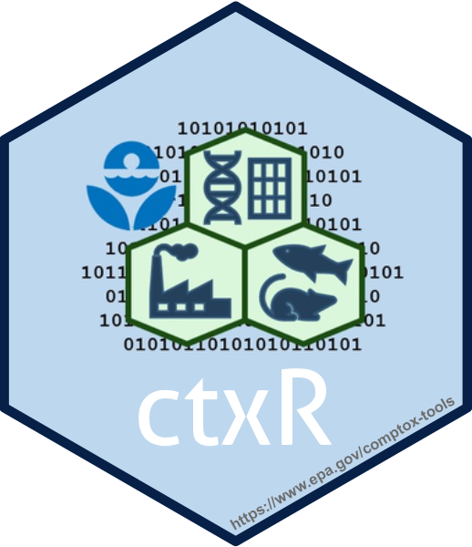
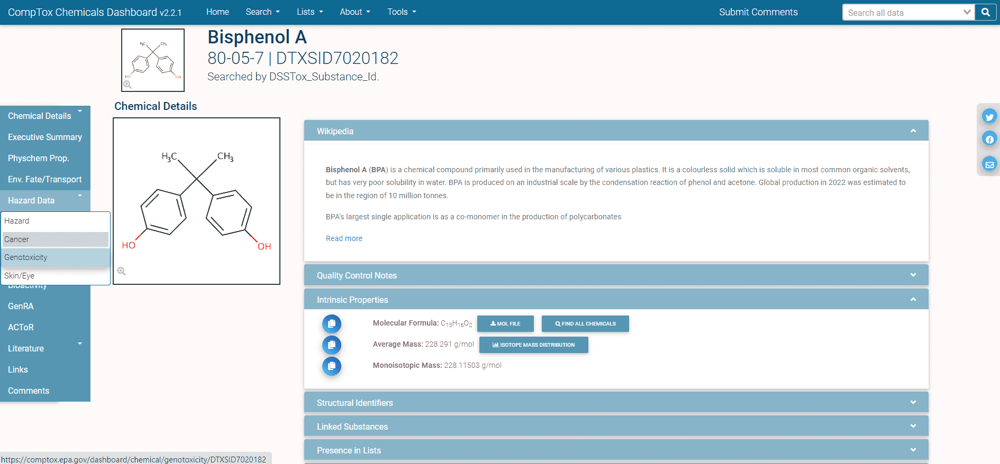
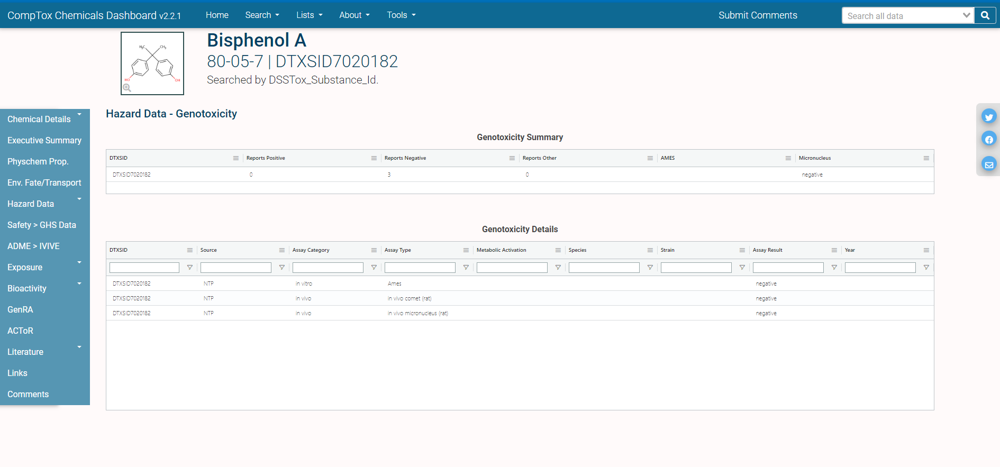
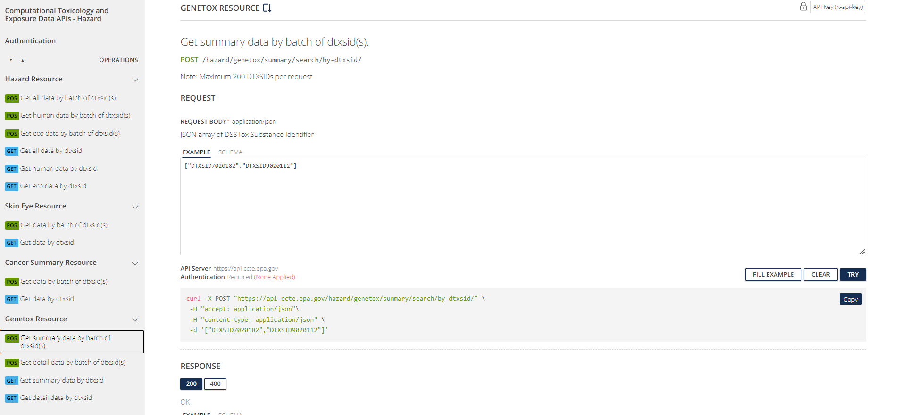

```{css, code = readLines(params$my_css), hide=TRUE, echo = FALSE}
```

```{r, include = FALSE}
knitr::opts_chunk$set(
  collapse = TRUE,
  comment = "#>"
)
library(httptest)
start_vignette("3")
```

```{r setup, echo=FALSE, message=FALSE, warning=FALSE}
if (!library(ctxR, logical.return = TRUE)){
  devtools::load_all()
}
old_options <- options("width")
```

```{r setup-print, echo = FALSE}
# Redefining the knit_print method to truncate character values to 25 characters
# in each column and to truncate the columns in the print call to prevent 
# wrapping tables with several columns.
#library(ctxR)
knit_print.data.table = function(x, ...) {
  y <- data.table::copy(x)
  y <- y[, lapply(.SD, function(t){
    if (is.character(t)){
      t <- strtrim(t, 25)
    }
    return(t)
  })]
  print(y, trunc.cols = TRUE)
}

registerS3method(
  "knit_print", "data.table", knit_print.data.table,
  envir = asNamespace("knitr")
)
```

<a href="https://CRAN.R-project.org/package=ctxR"></a>

## Introduction

In this vignette, [CTX Hazard API](https://api-ccte.epa.gov/docs/hazard.html) will be explored. 

Data for the Hazard API come from the Toxicity Value Database [(ToxValDB)](https://cfpub.epa.gov/si/si_public_record_Report.cfm?dirEntryId=344315&Lab=NCCT). ToxValDB includes data on thousands of chemicals from tens of thousands of records, with an emphasis on quantitative estimates of relevant points-of-departure from in vivo toxicology studies, such as no- and low-observable adverse effect levels, screening levels, reference doses, tolerable daily intake, etc. 

The Aggregated Computational Toxicology Resource [(ACToR)](https://www.epa.gov/comptox-tools/downloadable-computational-toxicology-data#actor) is currently being integrated into ToxValDB. ACToR, as described in [Judson et al (2008)](https://doi.org/10.1016/j.taap.2007.12.037), was designed to serve as a central location for information on chemical structure ***in vitro*** bioassays, and ***in vivo*** toxicology assays used in various [Computational Toxicology](https://www.epa.gov/comptox-tools) efforts at US EPA.

More information on ToxValDB can be found at <https://www.epa.gov/comptox-tools/downloadable-computational-toxicology-data#AT>. Additional resources are available under the "ToxVal" subtopic: [New Approach Methods training](https://www.epa.gov/chemical-research/new-approach-methods-nams-training).

::: {.noticebox data-latex=""}
**NOTE:** Please see the introductory vignette for an overview of the *ctxR* package and initial set up instruction with API key storage.
:::

Several ctxR functions can be used to access the CTX Hazard API data, as described in the following sections.Tables output in each example have been filtered to only display the first few rows of data. 

# Hazard Resource

## Get Hazard Data by DTXSID

`get_hazard_by_dtxsid()` retrieves all hazard data, both human and EcoTox data.

```{r ctxR all hazard, message=FALSE, eval=FALSE}
hazard_by_dtxsid <- get_hazard_by_dtxsid(DTXSID = 'DTXSID7020182')
```

## Get Human Hazard Data by DTXSID

`get_human_hazard_by_dtxsid()` retrieves only human hazard data.

```{r ctxR human hazard, message=FALSE, eval=FALSE}
human_hazard_by_dtxsid <- get_human_hazard_by_dtxsid(DTXSID = 'DTXSID7020182')
```

## Get EcoTox Hazard Data by DTXSID

`get_ecotox_hazard_by_dtxsid()` retrieves only ecological toxicity hazard data.

```{r ctxR ecotox hazard, message=FALSE, eval=FALSE}
ecotox_hazard_by_dtxsid <- get_ecotox_hazard_by_dtxsid(DTXSID = 'DTXSID7020182')
```

# Skin Eye Resource

`get_skin_eye_hazard()` retrieves hazard data specific to skin and eye hazard.

```{r ctxR skin and eye hazard, message=FALSE, eval=FALSE}
skin_eye_hazard <- get_skin_eye_hazard(DTXSID = 'DTXSID7020182')
```

# Cancer Resource

`get_cancer_hazard()` retrieves cancer hazard data. 

```{r ctxR cancer hazard, message=FALSE, eval=FALSE}
cancer_hazard <- get_cancer_hazard(DTXSID = 'DTXSID7020182')
```

# Genetox Resource

`get_genetox_summary()` retrieves summary level data for genotoxicity data associated to a chemical.

```{r ctxR genetox summary hazard, message=FALSE, eval=FALSE}
genetox_summary <- get_genetox_summary(DTXSID = 'DTXSID7020182')
```

`get_genetox_detail()` retrieves more detailed genetox data for a chemical than is provided on the summary level.

```{r ctxR genetox detail hazard, message=FALSE, eval=FALSE}
genetox_details <- get_genetox_details(DTXSID = 'DTXSID7020182')
```

# Example Use Case: Comparing Hazard Data Across Chemical Lists

The fourth Drinking Water Contaminant Candidate List (CCL4) is a set of chemicals that "...are not subject to any proposed or promulgated national primary drinking water regulations, but are known or anticipated to occur in public water systems...." Moreover, this list "...was announced on November 17, 2016. The CCL 4 includes 97 chemicals or chemical groups and 12 microbial contaminants...." The National-Scale Air Toxics Assessments (NATA) is "... EPA's ongoing comprehensive evaluation of air toxics in the United States... a state-of-the-science screening tool for State/Local/Tribal agencies to prioritize pollutants, emission sources and locations of interest for further study in order to gain a better understanding of risks... use general information about sources to develop estimates of risks which are more likely to overestimate impacts than underestimate them...."  

These lists can be found in the CCD at [CCL4](https://comptox.epa.gov/dashboard/chemical-lists/CCL4) with additional information at [CCL4 information](https://www.epa.gov/ccl/contaminant-candidate-list-4-ccl-4-0) and [NATADB](https://comptox.epa.gov/dashboard/chemical-lists/NATADB) with additional information at [NATA information](https://www.epa.gov/national-air-toxics-assessment). The quotes from the previous paragraph were excerpted from list detail descriptions found using the CCD links.

In this example use case, hazard data will be compared between a water contaminant priority and an air toxics list. 

## Obtain Lists of Chemicals

First, confirm the chemical list to query. We use functions that wrap some of the Chemical domain endpoints to retrieve information about the list of chemicals.

```{r}
options(width = 100)
ccl4_information <- get_public_chemical_list_by_name('CCL4')
print(ccl4_information, trunc.cols = TRUE)

natadb_information <- get_public_chemical_list_by_name('NATADB')
print(natadb_information, trunc.cols = TRUE)
```
Next, retrieve the list of chemicals associated with each list.

```{r}
ccl4 <- get_chemicals_in_list('CCL4')
ccl4 <- data.table::as.data.table(ccl4)

natadb <- get_chemicals_in_list('NATADB')
natadb <- data.table::as.data.table(natadb)
```

## Review Genotoxicity Data for a Single Chemical

Using the standard CompTox Chemicals Dashboard approach to access genotoxicity hazard data, one would navigate to the individual chemical page for [DTXSID7020182](https://comptox.epa.gov/dashboard/chemical/genotoxicity/DTXSID7020182) as shown below. 

<center>

{#id .class width=110% height=110%}
</center>

Figure 2 shows the genotoxicity section of the hazard tab for Bisphenol A. This page provides a summary of available genotoxicity data as well as individual reports and samples of such data.

<center>

{#id .class width=110% height=110%}
</center>

The CTX APIs streamline the process of retrieving this information in a programmatic fashion. Figure 3 shows the particular set of genotoxicity resources available in the `Hazard` endpoints of the CTX APIs. There are both summary and detail resources, reflecting the information one can find on the CompTox Chemicals Dashboard Genotoxicity page for a given chemical.

<center>

{#id .class width=110% height=110%}
</center>

## Review Genotoxicity Data for Chemical Lists

The function `get_genetox_summary()` is used to access summary genotoxicity information per chemical. To query a list of chemicals, rather than searching individually for each chemical, the batch search version of the function, `get_genetox_summary_batch()`, can be used to access these details.

First, pull the data.
```{r}
ccl4_genotox <- get_genetox_summary_batch(DTXSID = ccl4$dtxsid)
natadb_genetox <- get_genetox_summary_batch(DTXSID = natadb$dtxsid)
```

Next, it may be helpful to examine the dimensions and column names of the output.
```{r fig.align='center',class.source="scroll-300",message=FALSE}
dim(ccl4_genotox)
dim(natadb_genetox)
colnames(ccl4_genotox)
head(ccl4_genotox)
```

The information returned is of the first variety highlighted in the Figure 2, that is, summary data on the available genotoxicity data for each chemical. Observe genotoxicity data was returned for 71 chemicals from the CCL4 chemical list and 153 from the NATA chemical list. Chemicals missing genotoxicity data for each list are noted below. 

```{r fig.align='center',class.source="scroll-300",message=FALSE}
ccl4[!(dtxsid %in% ccl4_genotox$dtxsid), 
     .(dtxsid, casrn, preferredName, molFormula)]
natadb[!(dtxsid %in% natadb_genetox$dtxsid), 
       .(dtxsid, casrn, preferredName, molFormula)]
```

Now, genotoxicity details of the chemicals in each chemical list are returned using the function `get_genetox_details_batch()`. 

```{r fig.align='center',class.source="scroll-300",message=FALSE}
ccl4_genetox_details <- get_genetox_details_batch(DTXSID = ccl4$dtxsid)
natadb_genetox_details <- get_genetox_details_batch(DTXSID = natadb$dtxsid)
```

If inspecting the first chemical in each set of results, DTXSID0020153, notice that the information is identical in each case as this information is chemical specific and not chemical list specific.
```{r}
identical(ccl4_genetox_details[dtxsid %in% 'DTXSID0020153', ], 
          natadb_genetox_details[dtxsid %in% 'DTXSID0020153', ])
```

Assays present for chemicals in each chemical list can be explored. First, determine the unique values of the `assayCategory` column and then group by these values and determine the number of unique assays for each `assayCategory` value.
```{r fig.align='center',class.source="scroll-300",message=FALSE}
ccl4_genetox_details[, unique(assayCategory)]
natadb_genetox_details[, unique(assayCategory)]
ccl4_genetox_details[, unique(assayType)]
natadb_genetox_details[, unique(assayType)]
```

Next, determine the number of assays per unique `assayCategory` value, count the number of assay results and grouping by `assayCategory`, and `assayType`, and also examine the different numbers of `assayCategory` and `assayTypes` values used for both chemical lists.
```{r fig.align='center',class.source="scroll-300",message=FALSE}
ccl4_genetox_details[, .(Assays = length(unique(assayType))), 
                     by = .(assayCategory)]
natadb_genetox_details[, .(Assays = length(unique(assayType))),
                       by = .(assayCategory)]

ccl4_genetox_details[, .N, by = .(assayCategory, assayType, assayResult)]
ccl4_genetox_details[, .N, by = .(assayCategory)]
ccl4_genetox_details[assayCategory == 'in vitro', .N, by = .(assayType)]
ccl4_genetox_details[assayCategory == 'ND', .N, by = .(assayType)]
ccl4_genetox_details[assayCategory == 'in vivo', .N, by = .(assayType)]

natadb_genetox_details[, .N, by = .(assayCategory, assayType, assayResult)]
natadb_genetox_details[, .N, by = .(assayCategory)]
natadb_genetox_details[assayCategory == 'in vitro', .N, by = .(assayType)]
natadb_genetox_details[assayCategory == 'ND', .N, by = .(assayType)]
natadb_genetox_details[assayCategory == 'in vivo', .N, by = .(assayType)]
```

Observe that there are 90 unique assays for CCl4 and 114 unique assays for NATADB. The different assay categories are "in vitro", "ND", and "in vivo", with 65 unique "in vitro" assays for CCl4 and 83 for NATADB, 3 unique "ND" assays for CCL4 and 3 for NATADB, and 22 unique "in vivo" assays for CCL4 and 28 for NATADB.

One may be interested in looking at the number of chemicals for which an assay resulted in a positive or negative result. To assess this, group by `assayResult` and determine the number of unique `dtxsid` values associated with each `assayResult` value.

```{r}
ccl4_genetox_details[, .(DTXSIDs = length(unique(dtxsid))), by = .(assayResult)]
natadb_genetox_details[, .(DTXSIDs = length(unique(dtxsid))), 
                       by = .(assayResult)]
```

For CCL4, there are 64 unique chemicals that have a negative assay result, 53 that have a positive result, and 15 that have an equivocal result. For NATADB, there are 141 unique chemicals that have a negative assay result, 130 that have a positive result, and 48 that have an equivocal result. Observe that since there are 72 unique `dtxsid` values with assay results in CCL4 and 153 in NATADB, there are several chemicals that have multiple assay results.

Next, determine the chemicals from each chemical list that are known to have genotoxic effects. For this, examine which chemicals produce at least one positive response in the `assayResult` column.

```{r fig.align='center',class.source="scroll-300",message=FALSE}
ccl4_genetox_details[, .(is_positive = any(assayResult == 'positive')), 
                     by = .(dtxsid)][is_positive == TRUE, dtxsid]
natadb_genetox_details[, .(is_positive = any(assayResult == 'positive')),
                       by = .(dtxsid)][is_positive == TRUE, dtxsid]
```

Given the amount of genotoxicity data, consider one chemical, DTXSID0020153, to get a sense of the assays, the number of each type of result, and which correspond to "positive" results. To determine this, group by `assayResult` and calculate `.N` for each group. We also isolate which were positive and output a data.table with the number of each type.

```{r fig.align='center',class.source="scroll-300",message=FALSE}
ccl4_genetox_details[dtxsid == 'DTXSID0020153', .(Number = .N), 
                     by = .(assayResult)]
ccl4_genetox_details[dtxsid == 'DTXSID0020153' & assayResult == 'positive', 
                     .(Number_of_assays = .N), by = .(assayType)][order(-Number_of_assays),]
```

There were five assays that produced a negative result, 22 that produced a positive result, and one that produced an equivocal result. Of the 22 positive assays, "bacterial reverse mutation assay" and "Ames" were the most numerous, with three each.

## Review Hazard Data for Chemical Lists

Hazard data associated with the chemicals in each chemical list can be retrieved. For each chemical, there are potentially hundreds of rows of hazard data, so the returned results will be much larger than in most other API endpoints. We model how one would structure such a query of the chemicals in CCL4 and NATADB, and leave it to the reader to explore the data in a similar fashion to the previous examples.

```{r, eval = FALSE}
ccl4_hazard <- get_hazard_by_dtxsid_batch(DTXSID = ccl4$dtxsid)
natadb_hazard <- get_hazard_by_dtxsid_batch(DTXSID = natadb$dtxsid)
```

Next, it may be helpful to examine the dimensions and column names of the output.
```{r, eval = FALSE, fig.align='center',class.source="scroll-300",message=FALSE}
dim(ccl4_hazard)
dim(natadb_hazard)
colnames(ccl4_hazard)
head(ccl4_hazard)
```

# Conclusion

In this vignette, a variety of functions that access different types of data found in the `Hazard` endpoints of the CTX APIs were explored. While this exploration was not exhaustive, it provides a basic introduction to how one may access data and work with it. Additional endpoints and corresponding functions exist and we encourage the user to explore these while keeping in mind the examples contained in this vignette.

```{r breakdown, echo = FALSE, results = 'hide'}
# This chunk will be hidden in the final product. It serves to undo defining the
# custom print function to prevent unexpected behavior after this module during
# the final knitting process and restores original option values.

knit_print.data.table = knitr::normal_print
  
registerS3method(
  "knit_print", "data.table", knit_print.data.table,
  envir = asNamespace("knitr")
)

options(old_options)
```

```{r, include=FALSE}
end_vignette()
```
