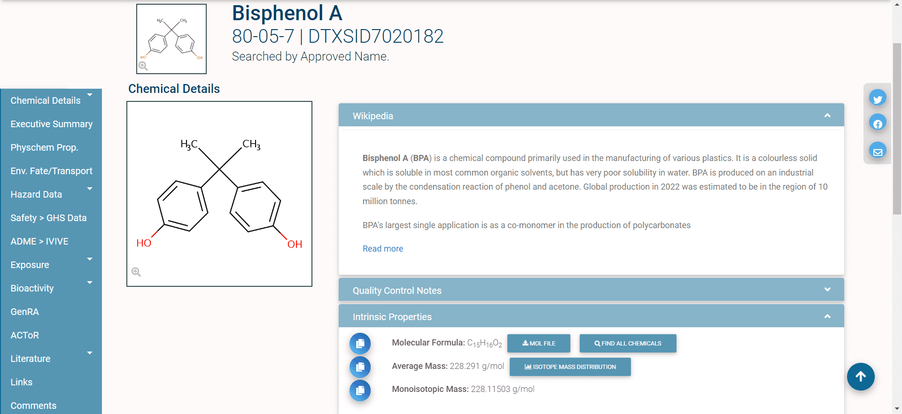
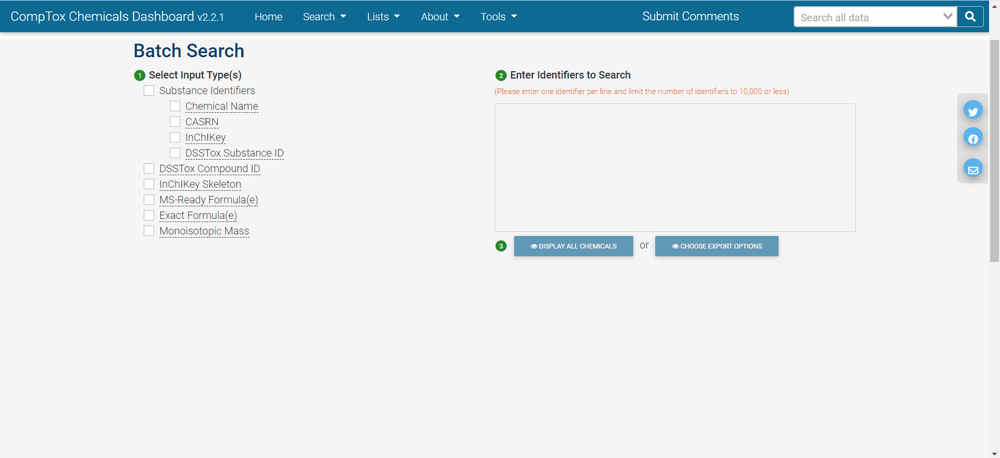
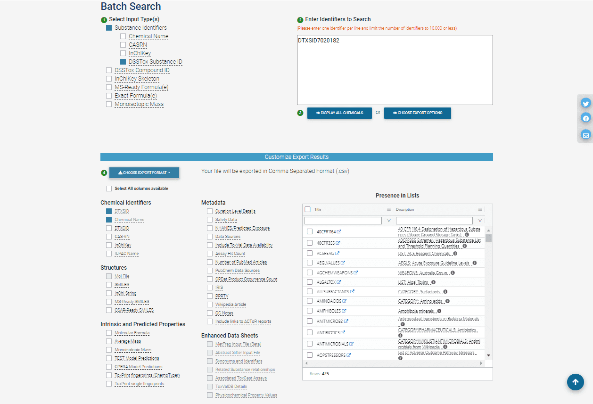
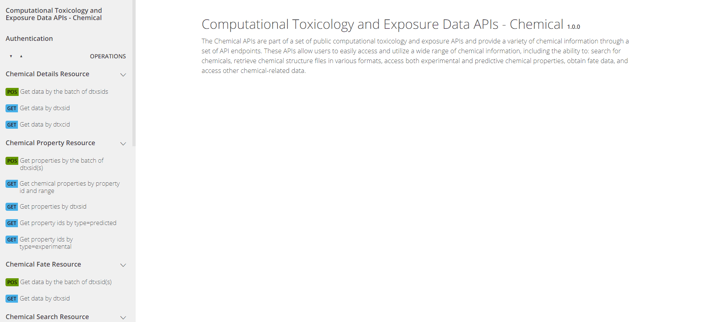
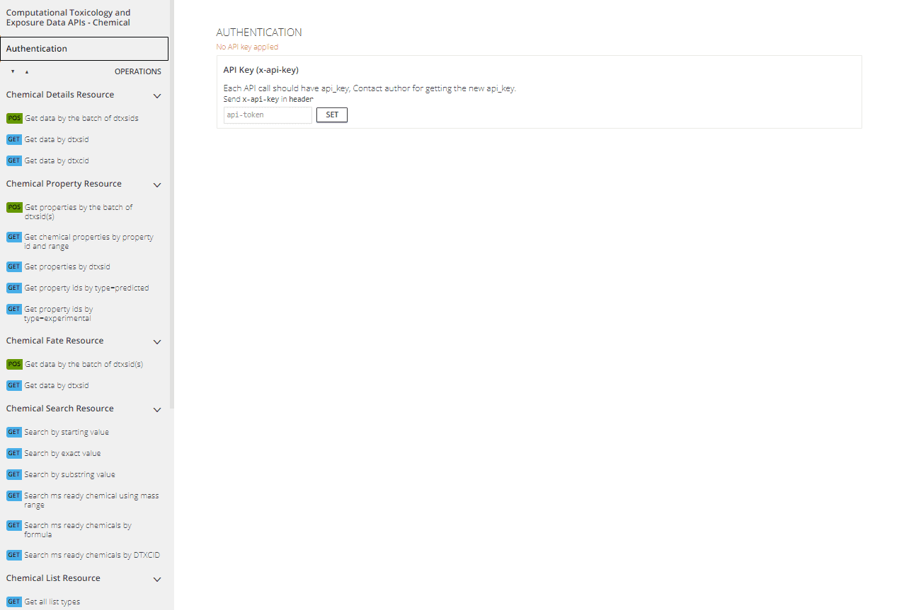
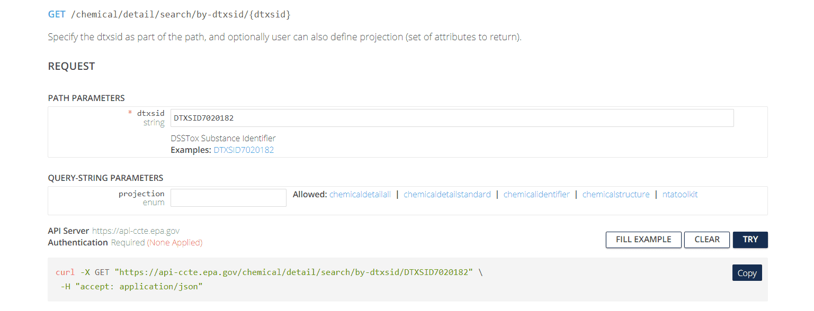
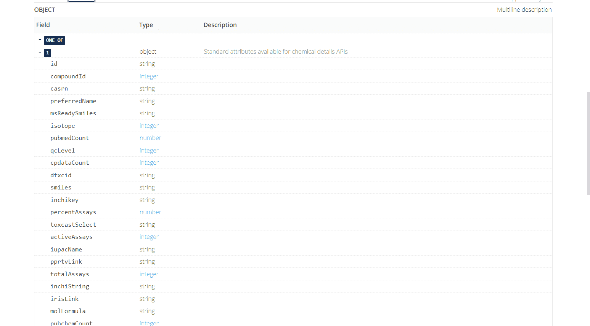

```{css, code = readLines(params$my_css), hide=TRUE, echo = FALSE}
```

```{r, include = FALSE}
knitr::opts_chunk$set(
  collapse = TRUE,
  comment = "#>",
  eval = (nchar(Sys.getenv('CTX_API_KEY')) > 0)
)
library(httptest)
start_vignette("1")
```

```{r setup, echo=FALSE}
if (!library(ctxR, logical.return = TRUE)){
  devtools::load_all()
}
```

```{r setup-print, echo = FALSE}
# Redefining the knit_print method to truncate character values to 25 characters
# in each column and to truncate the columns in the print call to prevent 
# wrapping tables with several columns.
#library(ctxR)
knit_print.data.table = function(x, ...) {
  y <- data.table::copy(x)
  y <- y[, lapply(.SD, function(t){
    if (is.character(t)){
      t <- strtrim(t, 25)
    }
    return(t)
  })]
  print(y, trunc.cols = TRUE)
}

registerS3method(
  "knit_print", "data.table", knit_print.data.table,
  envir = asNamespace("knitr")
)
```

<a href="https://cran.r-project.org/web/packages/ctxR/index.html"></a>

# Introduction to the CCD

Accessing chemical data is a vital step in many workflows related to chemical, biological, and environmental modeling. While there are many resources available from which one can pull data, the [CompTox Chemicals Dashboard](https://comptox.epa.gov/dashboard/) (CCD), built and maintained by the United States Environmental Protection Agency, is particularly well-designed and suitable for these purposes. Originally introduced in [The CompTox Chemistry Dashboard: a community data resource for environmental chemistry](https://jcheminf.biomedcentral.com/articles/10.1186/s13321-017-0247-6), the CCD contains information on over 1.2 million chemicals as of May 2024 and has been cited 612 times according to CrossRef. To learn more about the CCD, please visit the page [About CCD](https://www.epa.gov/comptox-tools/comptox-chemicals-dashboard-about).

The CCD includes chemical information from many different domains, including physicochemical, environmental fate and transport, exposure, usage, *in vivo* toxicity, and *in vitro* bioassay data. For information on data sources and current versions, please review the [CCD Release Notes](https://www.epa.gov/comptox-tools/comptox-chemicals-dashboard-release-notes). It provides a graphical user interface that allows for an interactive user experience and is easy to navigate. As such, users can explore the data available on the CCD without any programming background.

The CCD can be queried for one chemical at a time or using batch search.

## Searching one chemical at a time (single-substance search)

In single-substance search, the user enters a full or partial chemical identifier (name, CASRN, InChiKey, or DSSTox ID) into a search box on the CCD homepage. Autocomplete can provide a list of possible matches. Figure 1 shows an example: the CCD landing page for the chemical [Bisphenol A](https://comptox.epa.gov/dashboard/chemical/invitrodb/DTXSID7020182). This page is generated for Bisphenol A and links to but does not represent other chemicals. Each chemical in the CCD has its own page similar to this, with varying levels of accessible based on the information that is available.

<center>



</center>

The different domains of data available for this chemical are shown by the tabs on the left side of the page: for example, "Physchem Prop." (physico-chemical properties), "Env. Fate/Transport" (environmental fate and transport data), and "Hazard Data" (*in vivo* hazard and toxicity data), among others. 

## Batch search

In [batch search](https://comptox.epa.gov/dashboard/batch-search), the user enters a list of search inputs, separated by new lines, into a search box. The user selects the type(s) of inputs by selecting one or more checkboxes – include chemical identifiers, monoisotopic masses, or molecular formulas. Then, the user selects “Display All Chemicals” to display the list of substances matching the batch-search inputs, or “Choose Export Options” to choose options for exporting the batch-search results as a spreadsheet. The exported spreadsheet may include data from most of the domains available on an individual substance’s CCD page.

<center>



</center>

The user can download the selected information in various formats, such as Excel (.xlsx), comma-separated values (.csv), or different types of chemical table files (.e.g, MOL). 

<center>



</center>

The web interface for batch search only allows input of 10,000 identifiers at a time. If a user wants to retrieve information for more than 10,000 chemicals, identifiers will need to be separated into multiple batches and searched separately.

## Challenges of web-based dashboard search

Practicing researchers may follow a workflow that looks something like this:

1.	Start with a dataset that includes your chemical identifiers of interest. These may include chemical names, Chemical Abstract Service Registry Numbers (CASRNs), Distributed Searchable Structure-Toxicity Database (DSSTox) identifiers, or InChIKeys.
2.	Export the chemical identifiers to a spreadsheet. Often, this is done by importing the data into an environment such as R or Python, in order to do some data wrangling (e.g., to select only the unique substance identfiers; to clean up improperly-formatted CASRNs; etc.). Then, the identifiers are saved in a spreadsheet (an Excel, .csv, or .txt file), one chemical identifier per row.
3.	Copy and paste the chemical identifiers from the spreadsheet into the CCD Batch Search box. If there are more than 10,000 total chemical identifiers, divide them into batches of 10,000 or less, and search each batch separately.
4.	Choose your desired export options on the CCD Batch Search page.
5.	Download the exported spreadsheet of CCD data. By default, the downloaded spreadsheet will be given a file name that includes the timestamp of the download.
6.	Repeat steps 3-5 for each batch of 10,000 identifiers produced in step 2. 
7.	Import the downloaded spreadsheet(s) of CCD data into the analysis tool you are using (e.g. R or Python).
8.	Merge the table(s) of downloaded CCD data with your original dataset of interest.
9.	Proceed with research-related data analysis using the chemical data downloaded from the CCD (e.g., statistical modeling, visualization, etc.)

Because each of these workflow steps requires manual interaction with the search and download process, the risk of human error inevitably creeps in. Here are a few real-world possibilities (the authors can neither confirm nor deny that they have personally committed any of these errors):

-	Researchers could copy/paste the wrong identifiers into the CCD batch search, especially if more than 10,000 identifiers need to be divided into separate batches.
-	Chemical identifiers could be corrupted during the process of exporting to a spreadsheet. 
    - If a researcher opens and resaves a CSV file using Microsoft Excel, any information that appears to be in date-like format will be automatically converted to a date (unless the researcher has the most recently-updated version of Excel and has selected the option in Settings that will stop Excel from auto-detecting dates). This behavior has long been identified as a problem in genomics, where gene names can appear date-like to Excel (Abeysooriya et al. 2021). It also affects cheminformatics, where chemical identifiers can appear date-like to Excel. For example, the valid CASRN “1990-07-4” would automatically be converted to “07/04/1990” (if Excel is set to use MM/DD/YYYY date formats). CCD batch search cannot recognize "07/04/1990" as a valid chemical identifier and will be unable to return any chemical data.
-	Researchers could accidentally rename a downloaded CCD data file to overwrite a previous download, e.g. when searching multiple batches of identifiers. 
-	Researchers could mistakenly import the wrong CCD download file back into their analysis environment e.g. when searching multiple batches of identifiers. 

Moreover, the manual stages of this kind of workflow are also non-transparent and not easily reproducible. Utilizing APIs for data exploration and retrieval can alleviate these concerns. 

# Introduction to the CTX APIs

Recently, the [US EPA's Center for Computational Toxicology and Exposure (CCTE)](https://www.epa.gov/aboutepa/about-center-computational-toxicology-and-exposure-ccte) developed a set of Application Programming Interfaces (APIs) that allows programmatic access to the CCD, bypassing the manual steps of the web-based batch search workflow. APIs effectively automate the process of accessing and downloading the data that populates the CCD. 

The [Computational Toxicology and Exposure (CTX) APIs](https://www.epa.gov/comptox-tools/computational-toxicology-and-exposure-apis) are publicly available at no cost to the user. However, in order to use the CTX APIs, users must have a individual API key. The API key uniquely identifies the user to the CCD servers and verifies that you have permission to access the database. Getting an API key is free, but requires contacting the API support team at [ccte_api@epa.gov](mailto:ccte_api@epa.gov).

The APIs are organized into sets of "endpoints" by data domains: `Chemical`, `Hazard`, and `Bioactivity`. An endpoint provides access to a specific set of information and data, e.g. physical-chemical properties for a chemical that the user specifies. A view from the [Chemical API](https://api-ccte.epa.gov/docs/chemical.html) web interface is pictured below.

<center>



</center>

On the left side of each domain's web interface page, there will be several different tabs listed depending on information requests available within the domain. In Figure 4, the `Chemical Details Resource` endpoint provides basic chemical information; the `Chemical Property Resource` endpoint provides more comprehensive physico-chemical property information; the `Chemical Fate Resource` endpoint provides chemical fate and transport information; and so on. 

## Authentication

`Authentication`, found in upper left tab on each web interface page, is required to use the APIs. To authenticate themselves in the API web interface, the user must input their unique API key.

<center>



</center>

## Request Construction

APIs effectively automate the process of accessing and downloading the data that populates the CCD. APIs do this via requests using the Hypertext Transfer Protocol (HTTP) that enables communication between clients (e.g. your computer) and servers (e.g. the CCD).

In the CTX API web interface, the colored boxes next to each endpoint indicate the type of the associated HTTP method. <span style="color:blue">GET</span> is used to request data from a specific web resource (e.g. a specific URL); <span style="color:green">POST</span> is used to send data to a server to create or update a web resource. For the CTX APIs, <span style="color:green">POST</span> requests are used to perform multiple (batch) searches in a single API call; <span style="color:blue">GET</span> requests are used for non-batch searches. 

You do not need to understand the details of POST and GET requests in order to use the API. Let's consider constructing an API request to `Get data by dtxsid` under the `Chemical Details Resource`.

<center>



</center>

The web interface has two subheadings:

- **Path Parameters** contain user-specified parameters that are required in order to tell the API what URL (web address) to access. In this case, the required parameter is a string for the DTXSID identifying the chemical to be searched.
- **Query-String Parameters** contain user-specific parameters (usually optional) that tell the API what specific type(s) of information to download from the specified URL. In this case, the optional parameter is a `projection` parameter, a string that can take one of five values (`chemicaldetailall`, `chemicaldetailstandard`, `chemicalidentifier`, `chemicalstructure`, `ntatoolkit`). Depending on the value of this string, the API can return different sets of information about the chemical. If the `projection` parameter is left blank, then a default set of chemical information is returned.

The default return format is displayed below and includes a variety of fields with data types represented.


<center>



</center>

Pictured below is an example of returned Details for Bisphenol A with the `chemicaldetailstandard` value for `projection` selected.

<center>


</center>

# Introduction to ctxR

Formatting an http request is not necessarily intuitive nor worth the time for someone not already familiar with the process, so these endpoints may provide a resource that for many would require a significant investment in time and energy to learn how to use. However, there is a solution to this in the form of the R package *ctxR*.

*ctxR* was developed to streamline the process of accessing the information available through the CTX APIs without requiring prior knowledge of how to use APIs. 

## Package Settings

Users can run `library(ctxR)` to install from CRAN or install the development version of ctxR like so:

```{r, eval=FALSE}
if (!library(devtools, logical.return = TRUE)){
  install.packages(devtools)
  library(devtools)}

devtools::install_github("USEPA/ctxR")
```

## API Key Storage

As previously described, a user must have an API key to use in order to access the CTX APIs. A *FREE* API key can be obtained by emailing the [CTX API Admins](mailto:ccte_api@epa.gov). In the example code, the API key will be stored as the variable `my_key`.

```{r, echo = FALSE}
my_key <- ctx_key()
```

```{r, eval = FALSE, api-key}
my_key <- 'YOUR_CTX_API_key'
```

For general use of the package, the user may use the function `register_ctx_api_key()` to store the API key in the current session or more permanently for access across sessions.

```{r, register-ctxR, eval=FALSE}
# This stores the key in the current session
register_ctx_api_key(key = '<YOUR API KEY>')

# This stores the key across multiple sessions and only needs to be run once. If the key changes, rerun this with the new key.
register_ctx_api_key(key = '<YOUR API KEY>', write = TRUE)
```

Once the API key is stored, the default display setting is turned off for protection. To change this, use the following functions as demonstrated.

```{r, display-hide-key}
# To show the API key
ctxR_show_api_key()
getOption('ctxR')$display_api_key

# To hide the API key
ctxR_hide_api_key()
getOption('ctxR')$display_api_key
```

Finally, to access the key, use the `ctx_key()` function.

```{r, ctx-key, eval = FALSE}
ctx_key()
```

# Quick Start Examples

As some quick start examples, we demonstrate the ease* of retrieving the information across endpoints for Bisphenol A using *ctxR*. *This is in contrast to the approach using the CCD or API web interface. 

Tables output in each example have been filtered to only display the first few rows of data. For additional examples and more comprehensive documentation on each endpoint, consider reviewing the other ctxR vignettes for the data domain of interest. 

## Chemical API

In this section, several ctxR functions are used to access different types of information from the [CTX Chemical API](https://api-ccte.epa.gov/docs/chemical.html#/).

### Chemical Details Resource

The function `get_chemical_details()` takes in either the DTXSID or DTXCID of a chemical and the user-specific API key. Relevant chemical details for Bisphenol A, which has DTXSID "DTXSID7020182", are obtained in a data.table. 

```{r, bpa-chem-details}
bpa_details <- get_chemical_details(DTXSID = 'DTXSID7020182')
```

```{r, echo=FALSE}
htmlTable::htmlTable(head(bpa_details),
        align = 'l',
        align.header = 'l',
        rnames = FALSE  ,
        css.cell =  ' padding-bottom: 5px;  vertical-align:top; padding-right: 10px;min-width: 5em ')
```

### Chemical Property Resource

The function `get_chem_info()` returns phys-chem properties for the selected chemical, and can be filtered to 'experimental' or 'predicted' if desired.

Here all phys-chem properties are returned for Bisphenol A. 

```{r, bpa-chem-info}
bpa_info <- get_chem_info(DTXSID = "DTXSID7020182")
```

```{r, echo=FALSE}
htmlTable::htmlTable(head(bpa_info),
        align = 'l',
        align.header = 'l',
        rnames = FALSE  ,
        css.cell =  ' padding-bottom: 5px;  vertical-align:top; padding-right: 10px;min-width: 5em ')
```

Request can be filtered to return experimental results only.

```{r, bpa-experimental}
bpa_info_experimental <- get_chem_info(DTXSID = "DTXSID7020182", type = 'experimental')
```
```{r, echo=FALSE}
htmlTable::htmlTable(head(bpa_info_experimental),
        align = 'l',
        align.header = 'l',
        rnames = FALSE  ,
        css.cell =  ' padding-bottom: 5px;  vertical-align:top; padding-right: 10px;min-width: 5em ')
```

## Hazard API

In this section, several ctxR functions are used to access different types of information from the [CTX Hazard API](https://api-ccte.epa.gov/docs/hazard.html#/).

### Hazard Resource

The function `get_hazard_by_dtxsid()` retrieves hazard data (all human or ecological toxicity data) for a given chemical based on input DTXSID. `get_human_hazard_by_dtxsid()` and `get_ecotox_hazard_by_dtxsid()` can filter returned hazard results for the given chemical to human or ecological toxicity data, respectively.

Here all hazard data is returned for Bisphenol A:

```{r, hazard}
bpa_hazard <- get_hazard_by_dtxsid(DTXSID = 'DTXSID7020182')
```

```{r, echo=FALSE}
htmlTable::htmlTable(head(bpa_hazard_info),
        align = 'l',
        align.header = 'l',
        rnames = FALSE  ,
        css.cell =  ' padding-bottom: 5px;  vertical-align:top; padding-right: 10px;min-width: 5em ')
```

Request can be refined to return results for human hazard,

```{r, human-hazard}
bpa_human_hazard <- get_human_hazard_by_dtxsid(DTXSID = 'DTXSID7020182')
```

```{r, echo=FALSE}
htmlTable::htmlTable(head(bpa_human_hazard),
        align = 'l',
        align.header = 'l',
        rnames = FALSE  ,
        css.cell =  ' padding-bottom: 5px;  vertical-align:top; padding-right: 10px;min-width: 5em ')
```

or EcoTox results.

```{r, ecotox-hazard}
bpa_eco_hazard <- get_ecotox_hazard_by_dtxsid(DTXSID = 'DTXSID7020182')
```

```{r, echo=FALSE}
htmlTable::htmlTable(head(bpa_eco_hazard),
        align = 'l',
        align.header = 'l',
        rnames = FALSE  ,
        css.cell =  ' padding-bottom: 5px;  vertical-align:top; padding-right: 10px;min-width: 5em ')
```

## Bioactivity API

In this section, several ctxR functions are used to access different types of information from the [CTX Bioactivity API](https://api-ccte.epa.gov/docs/bioactivity.html#/).

### Bioactivity Resource

The function `get_bioactivity_details()` retrieves all bioactivity data for a given chemical based on input DTXSID. 

```{r, bioactivity-dtxsid}
bpa_bioactivity <- get_bioactivity_details(DTXSID = 'DTXSID7020182')
```

```{r, echo=FALSE}
htmlTable::htmlTable(head(bpa_bioactivity),
        align = 'l',
        align.header = 'l',
        rnames = FALSE  ,
        css.cell =  ' padding-bottom: 5px;  vertical-align:top; padding-right: 10px;min-width: 5em ')
```

The function `get_bioactivity_details()` can also be used to retrieve all bioactivity data for a given endpoint, based on input AEID (assay endpoint identifier).

```{r, bioactivity-aeid}
assay_id_search <- get_bioactivity_details(AEID = 42)
```

```{r, echo=FALSE}
htmlTable::htmlTable(head(assay_id_search),
        align = 'l',
        align.header = 'l',
        rnames = FALSE  ,
        css.cell =  ' padding-bottom: 5px;  vertical-align:top; padding-right: 10px;min-width: 5em ')
```

# Conclusion

The *ctxR* package provides a streamlined approach to accessing data from the CCD for users with little or no prior experience using APIs. 

For additional examples and more comprehensive documentation on each endpoint, consider reviewing the other ctxR vignettes for the data domain of interest. 

```{r breakdown, echo = FALSE, results = 'hide'}
# This chunk will be hidden in the final product. It serves to undo defining the
# custom print function to prevent unexpected behavior after this module during
# the final knitting process

knit_print.data.table = knitr::normal_print
  
registerS3method(
  "knit_print", "data.table", knit_print.data.table,
  envir = asNamespace("knitr")
)
```

```{r, include=FALSE}
end_vignette()
```
