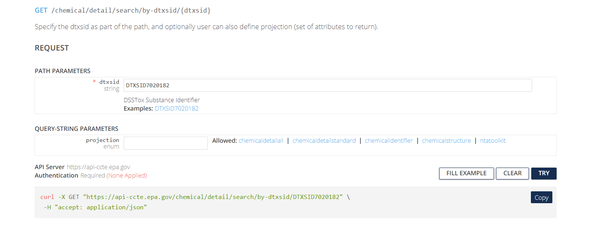

```{r, include = FALSE}
knitr::opts_chunk$set(
  collapse = TRUE,
  comment = "#>"
)
```

```{r setup}
#library(ccdR)
```

```{r, echo=FALSE, results='hide', message=FALSE, warning=FALSE}
# This code chunk is included during the development of this rmd and must be removed when deployed!!!
if (!library(ccdR, logical.return = TRUE)){
  devtools::load_all()
}
```


# Introduction

Accessing chemical data and wrangling it is a vital step in many types of workflows related to chemical, biological, and environmental modelling. While there are many resources available from which one can pull data, the [CompTox Chemicals Dashboard](https://comptox.epa.gov/dashboard/)(CCD) built and maintained by the United States Environmental Protection Agency is particularly well-designed and maintained. Originally introduced in [The CompTox Chemistry Dashboard: a community data resource for environmental chemistry](https://jcheminf.biomedcentral.com/articles/10.1186/s13321-017-0247-6), the CCD contains information on over 1.2 million chemicals as of September, 2023. Information contained for chemicals featured in the CCD include but are not limited to phys-chem properties, documentation and curation information of the featured data, hazard and fate/transport data. One can see an example of this in the search for the chemical Bisphenol A. 

{width=120%}

As one may observe, on the left side of the image there are several tabs that contain information such as physico-chemical properties, Environmental Fate and Transport data, and hazard data among others. The data contained in these tabs is freely accessible but not necessarily in the best format for data wrangling.

One can use the batch search functionality of the CCD to pull together desired data for a specific user supplied list of chemicals.

{width=120%}

One can download the selected information in various formats, such as a excel, csv, or different types of MOL files. While this is suitable for many projects, it does not necessarily work well when a programmatic approach to a modelling problem is desired. The steps involving inputting chemical identifier information, exporting into a file, loading and wrangling the data from file is both time consuming and a potential source of human error that may be hard to identify after the fact. 

## CCTE APIs

Recently, the [Center for Computational Toxicology and Exposure](https://www.epa.gov/aboutepa/about-center-computational-toxicology-and-exposure-ccte)(CCTE) developed APIs that allow users to access the information curated and maintained within the CCD. The [CCTE APIs](https://api-ccte.epa.gov/docs/) are publicly available at no cost to the user. The first step for interacting with the information available through the APIs is acquiring an API key, by contacting the API support team at [ccte_api@epa.gov](ccte_api@epa.gov).

The APIs are organized into three sections of endpoints, `Chemical`, `Hazard`, and `Bioactivity`.Pictured below is what the `Chemical` section looks like and can be found at [CCTE API Chemical Endpoints](https://api-ccte.epa.gov/docs/chemical.html).

{width=120%}

Notice that Authentication is the first tab on the left and below it are several endpoints organized by what purpose they serve. Authentication is required to use the APIs and the API key authenticates the user. The endpoints are organized into categories of functional use, for instance providing basic information on a chemical in the `Chemical Details Resource`, more comprehensive physico-chemical properties in `Chemical Property Resource`, chemical fate and transport data in `Chemical Fate Resource`, and so on. Also notice that next to each endpoint is a box that indicates what the associated http request is to access the information. These are either a Post or a Get request. Clicking on the `Get data by DTXSID`, we observe that there are certain required pieces of information to construct the request and optional parameters to focus the request.

{width=120%}

The user is required to supply a string for the DTXSID and an optional `projection` parameter, which controls the scope of the information returned. The default return format is displayed below and includes a variety of fields with data types represented.

{width=120%}
We show what returned data from searching Bisphenol A looks like using this endpoint with the `chemicaldetailstandard` projection selected.

{width=120%}


Formatting an http request is not necessarily intuitive nor worth the time for someone not already familiar with the process, so these endpoints may provide a resource that for many would require a significant investment in time and energy to learn how to use. However, there is a solution to this in the form of the R package ccdR.

This R package was developed to streamline the process of accessing the information available through the CCTE APIs without requiring prior knowledge of how to use APIs. As an example, we demonstrate the ease with which one may retrieve the information given by this endpoint for Bisphenol A using the ccdR approach and contrast it with the approach using the CCD or CCTE Chemical Endpoint website.

First, we load in ccdR and other libraries we will need for this module.

### Installing required R packages

```{r, eval = FALSE}
if (!requireNamespace('ccdR'))
  install.packages('ccdR');
```

### Loading R packages required for this session

```{r, eval = FALSE}
library(ccdR)
```

First, we store the API key required to access the APIs. To do this for the current session, run the first command. If you want to store your key across multiple sessions, run the second command.

```{r, eval=FALSE}
# This stores the key in the current session
register_ccdr(key = '<YOUR API KEY>')

# This stores the key across multiple sessions and only needs to be run once. 
# If the key changes, rerun this with the new key.
register_ccdr(key = '<YOUR API KEY>', write = TRUE)
```

To check that your key has successfully been stored for the session, run the following command.

```{r}
ccte_key()
```
Now, we demonstrate how to retrieve the information for BPA given by the `Chemical Detail Resource` endpoint under the `chemicaldetailstandard` projection. Note, this projection is the default projection for the function `get_chemical_details()`.

```{r}
BPA_chemical_detail <- get_chemical_details(DTXSID = 'DTXSID7020182')
BPA_chemical_detail
class(BPA_chemical_detail)
names(BPA_chemical_detail)
```


# Physico-chemical properties

We study two different data sets contained in the CCD and observe how they relate and how they differ. The two data sets that we will first explore are the water contaminant priority list, ccl4, and NATA air pollutants. These can be found in the CCD at [CCL4](https://comptox.epa.gov/dashboard/chemical-lists/CCL4) with additional information at [CCL4 information](https://www.epa.gov/ccl/contaminant-candidate-list-4-ccl-4-0) and [NATADB](https://comptox.epa.gov/dashboard/chemical-lists/NATADB). !!!ADD IN DESCRIPTION AND BACKGROUND INFORMATION FOR THESE DATA SETS!!!

We explore details about these before diving into analyzing the data contained in each list.

```{r}
ccl4_information <- get_public_chemical_list_by_name('CCL4')
ccl4_information

natadb_information <- get_public_chemical_list_by_name('NATADB')
natadb_information
```

Now we pull the actual chemicals contained in the lists using the APIs.

```{r}
ccl4 <- get_chemicals_in_list('ccl4')
ccl4 <- data.table::as.data.table(ccl4)

natadb <- get_chemicals_in_list('NATADB')
natadb <- data.table::as.data.table(natadb)

head(ccl4)
head(natadb)
```
We now collect the phys-chem properties of the chemicals in each list. We will use the batch forms of the function `get_chem_info()`, to which we supply a list of DTXSIDs.

```{r}
ccl4$dtxsid
natadb$dtxsid

ccl4_phys_chem <- get_chem_info_batch(ccl4$dtxsid)
natadb_phys_chem <- get_chem_info_batch(natadb$dtxsid)
```
Observe that this returns a single data.table for each query, and the data.table contains the phys-chem properties available from the CCD for each chemical in the query. We examine the set of phys-chem properties for the first chemical in ccl4.First we look at all the phys-chem properties individually, then group them by each property (`boiling-point`, `melting-point`, etc...) and then additional group those by property type (`experimental` vs `predicted`). In the grouping, we look at the columns `value`, `unit`, `propertyID` and `propType`. We also demonstrate how take the mean of the values for each grouping.

```{r}
ccl4_phys_chem[dtxsid == ccl4$dtxsid[[1]], ]
ccl4_phys_chem[dtxsid == ccl4$dtxsid[[1]], .(propType, value, unit), by = .(propertyId)]
ccl4_phys_chem[dtxsid == ccl4$dtxsid[[1]], .(value, unit), by = .(propertyId, propType)]

ccl4_phys_chem[dtxsid == ccl4$dtxsid[[1]], .(sapply(.SD, mean)), by = .(propertyId, unit), .SDcols = c("value")]
ccl4_phys_chem[dtxsid == ccl4$dtxsid[[1]], .(sapply(.SD, mean)), by = .(propertyId, unit, propType), .SDcols = c("value")][order(propertyId)]
```
Now, we examine the vapor pressures for all the chemicals in each list. We then graph these, grouped by `propType` and pooled together in separate plots. For this we will use boxplots.

```{r}
library(ggplot2)

ccl4_vapor_all <- ccl4_phys_chem[propertyId %in% 'vapor-pressure', sapply(.SD, mean), .SDcols = c('value'), by = .(dtxsid)]
ccl4_vapor_grouped <- ccl4_phys_chem[propertyId %in% 'vapor-pressure', sapply(.SD, mean), .SDcols = c('value'), by = .(dtxsid, propType)]

natadb_vapor_all <- natadb_phys_chem[propertyId %in% 'vapor-pressure', sapply(.SD, mean), .SDcols = c('value'), by = .(dtxsid)]
natadb_vapor_grouped <- natadb_phys_chem[propertyId %in% 'vapor-pressure', sapply(.SD, mean), .SDcols = c('value'), by = .(dtxsid, propType)]


summary(ccl4_vapor_all)
summary(ccl4_vapor_grouped)
summary(natadb_vapor_all)
summary(natadb_vapor_grouped)
```
With such a large range covering several orders of magnitude, we log transform the data. Since these value are positive, we do not have to worry about illegal transformations.

```{r}
ccl4_vapor_all[, log_transform := log(V1)]
ccl4_vapor_grouped[, log_transform := log(V1)]

natadb_vapor_all[, log_transform := log(V1)]
natadb_vapor_grouped[, log_transform := log(V1)]
```


```{r}

ggplot(ccl4_vapor_all, aes(log_transform)) +
  geom_boxplot()
ggplot(ccl4_vapor_grouped, aes(propType, log_transform)) +
  geom_boxplot()

ggplot(natadb_vapor_all, aes(log_transform)) +
  geom_boxplot()
ggplot(natadb_vapor_grouped, aes(propType, log_transform)) +
  geom_boxplot()
```

Finally, we compare both sets simultaneously. We add in a column to each data.table denoting to which set the rows correspond and then `rbind` the rows together.

```{r}
ccl4_vapor_grouped[, set := 'CCL4']
natadb_vapor_grouped[, set := 'NATADB']

all_vapor_grouped <- rbind(ccl4_vapor_grouped, natadb_vapor_grouped)

vapor_box <- ggplot(all_vapor_grouped, aes(set, log_transform)) + 
  geom_boxplot(aes(color = propType))
vapor_box
```

We also explore Henry's Law constant and boiling point.

```{r}
ccl4_hlc_all <- ccl4_phys_chem[propertyId %in% 'henrys-law', sapply(.SD, mean), .SDcols = c('value'), by = .(dtxsid)]
ccl4_hlc_grouped <- ccl4_phys_chem[propertyId %in% 'henrys-law', sapply(.SD, mean), .SDcols = c('value'), by = .(dtxsid, propType)]

natadb_hlc_all <- natadb_phys_chem[propertyId %in% 'henrys-law', sapply(.SD, mean), .SDcols = c('value'), by = .(dtxsid)]
natadb_hlc_grouped <- natadb_phys_chem[propertyId %in% 'henrys-law', sapply(.SD, mean), .SDcols = c('value'), by = .(dtxsid, propType)]


summary(ccl4_hlc_all)
summary(ccl4_hlc_grouped)
summary(natadb_hlc_all)
summary(natadb_hlc_grouped)
```
With such a large range covering several orders of magnitude, we log transform the data. Since these value are positive, we do not have to worry about illegal transformations.

```{r}
ccl4_hlc_all[, log_transform := log(V1)]
ccl4_hlc_grouped[, log_transform := log(V1)]

natadb_hlc_all[, log_transform := log(V1)]
natadb_hlc_grouped[, log_transform := log(V1)]
```

We compare both sets simultaneously. We add in a column to each data.table denoting to which set the rows correspond and then `rbind` the rows together.

```{r}
ccl4_hlc_grouped[, set := 'CCL4']
natadb_hlc_grouped[, set := 'NATADB']

all_hlc_grouped <- rbind(ccl4_hlc_grouped, natadb_hlc_grouped)

hlc_box <- ggplot(all_hlc_grouped, aes(set, log_transform)) + 
  geom_boxplot(aes(color = propType))
hlc_box
```

```{r}
ccl4_boiling_all <- ccl4_phys_chem[propertyId %in% 'boiling-point', sapply(.SD, mean), .SDcols = c('value'), by = .(dtxsid)]
ccl4_boiling_grouped <- ccl4_phys_chem[propertyId %in% 'boiling-point', sapply(.SD, mean), .SDcols = c('value'), by = .(dtxsid, propType)]

natadb_boiling_all <- natadb_phys_chem[propertyId %in% 'boiling-point', sapply(.SD, mean), .SDcols = c('value'), by = .(dtxsid)]
natadb_boiling_grouped <- natadb_phys_chem[propertyId %in% 'boiling-point', sapply(.SD, mean), .SDcols = c('value'), by = .(dtxsid, propType)]


summary(ccl4_boiling_all)
summary(ccl4_boiling_grouped)
summary(natadb_boiling_all)
summary(natadb_boiling_grouped)
```
With such a large range covering several orders of magnitude, we log transform the data. Since these value are positive, we do not have to worry about illegal transformations.

```{r}
ccl4_boiling_all[, log_transform := log(V1)]
ccl4_boiling_grouped[, log_transform := log(V1)]

natadb_boiling_all[, log_transform := log(V1)]
natadb_boiling_grouped[, log_transform := log(V1)]
```

We compare both sets simultaneously. We add in a column to each data.table denoting to which set the rows correspond and then `rbind` the rows together.

```{r}
ccl4_boiling_grouped[, set := 'CCL4']
natadb_boiling_grouped[, set := 'NATADB']

all_boiling_grouped <- rbind(ccl4_boiling_grouped, natadb_boiling_grouped)

boiling_box <- ggplot(all_boiling_grouped, aes(set, V1)) + 
  geom_boxplot(aes(color = propType))
boiling_box
```
Now, having examined some of the distributions of the phys chem properties of the two lists, aggregated between predicted and experimental, we move towards learning more about these chemicals beyond phys chem properties. Specifically, we will examine their genotoxicity.

To access the genetox endpoint, we will use the function `get_genetox_summary`. Since we have a list of chemicals, rather than searching individually for each chemical, we use the batch search version of the function, names `get_genetox_summary_batch`. We will examine this and then access the details.

```{r}
ccl4_genotox <- get_genetox_summary_batch(DTXSID = ccl4$dtxsid)
natadb_genetox <- get_genetox_summary_batch(DTXSID = natadb$dtxsid)
ccl4_genotox
natadb_genetox
```
Observe that we have information on 71 chemicals from the `ccl4` data and 153 from the `natadb` data. We note the chemicals not included in the results and then dig into the returned results.

```{r}
ccl4[!(dtxsid %in% ccl4_genotox$dtxsid), ]
natadb[!(dtxsid %in% natadb_genetox$dtxsid), ]
```

Now, we access the genetox details of the chemicals in each data set.

```{r}
ccl4_genetox_details <- get_genetox_details_batch(DTXSID = ccl4$dtxsid)
natadb_genetox_details <- get_genetox_details_batch(DTXSID = natadb$dtxsid)
ccl4_genetox_details
natadb_genetox_details
```

We examine the information returned for the first chemical in each set of results, which is DTXSID0020153. Notice that the information is identical in each case as this information is chemical specific and not data set specific.

```{r}
ccl4_genetox_details[dtxsid %in% 'DTXSID0020153', ]
natadb_genetox_details[dtxsid %in% 'DTXSID0020153', ]

```

We analyze these results more closely, counting the number of assay results and grouping by species, assayCategory, and assayType. We also examine the different numbers of assyCategory and assayTypes used.

```{r}
ccl4_genetox_details[, .N, by = .(species, assayCategory, assayType, assayResult)]
ccl4_genetox_details[, .N, by = .(assayCategory)]
ccl4_genetox_details[, .N, by = .(assayCategory, assayType)]
natadb_genetox_details[, .N, by = .(species, assayCategory, assayType, assayResult)]
natadb_genetox_details[, .N, by = .(assayCategory)]
natadb_genetox_details[, .N, by = .(assayType)]
```

We now determine which chemicals from each data set are known to have genotoxic effects. For this, we look to see which chemicals produce a positive response in the assayResult column.

```{r}
ccl4_genetox_details[, .(is_positive = any(assayResult == 'positive')), by = .(dtxsid)][is_positive == TRUE, dtxsid]
natadb_genetox_details[, .(is_positive = any(assayResult == 'positive')), by = .(dtxsid)][is_positive == TRUE, dtxsid]
```

Finally, we examine the hazard data associated with the chemicals in each data set. For each chemical, there will be potentially hundreds of rows of hazard data, so the returned results will be much larger than in most other API endpoints.

```{r}
ccl4_hazard <- get_hazard_by_dtxsid_batch(DTXSID = ccl4$dtxsid)
natadb_hazard <- get_hazard_by_dtxsid_batch(DTXSID = natadb$dtxsid)
```
We do some preliminary exploration of the data.

```{r}
ccl4_hazard[, .N, by = .(criticalEffect)]
ccl4_hazard[, .N, by = .(supercategory)]
ccl4_hazard[, .N, by = .(toxvalType)]

natadb_hazard[, .N, by = .(criticalEffect)]
natadb_hazard[, .N, by = .(supercategory)]
natadb_hazard[, .N, by = .(toxvalType)]
```
With over 20,000 results for `Point of Departure`, we dig into this further.

```{r}
ccl4_hazard[ supercategory %in% 'Point of Departure', .N, by = .(toxvalType)][order(-N),]
natadb_hazard[ supercategory %in% 'Point of Departure', .N, by = .(toxvalType)][order(-N),]
```

We choose `NOEL`, `NOEC`, `LOEL`, and `LOEC` to explore further. At this point, we will determine the units reported for each of these endpoints, make a conversion to the value if necessary, and then determine the chemical with the lowest dose required to elicit an response. We group by media and determine which media is feasible to study further.

```{r}
ccl4_hazard[toxvalType %in% c('NOEL', 'NOEC', 'LOEL', 'LOEC'), .(.N, by_media = length(unique(toxvalUnits))), by = .(media, toxvalType)][order(by_media, -N),][order(by_media, -N),]
natadb_hazard[toxvalType %in% c('NOEL', 'NOEC', 'LOEL', 'LOEC'), .(.N, by_media = length(unique(toxvalUnits))), by = .(media, toxvalType)][order(by_media, -N),][order(by_media, -N),]
```
It looks like using media of `soil` and `water` have a single unit and several chemicals represented for `NOEL` and `LOEL` for both data sets of chemicals.

```{r}
ccl4_hazard[media %in% 'soil' & toxvalType %in% c('LOEL', 'NOEL'), .(toxvalNumeric = min(toxvalNumeric)), by = .(toxvalType, toxvalUnits, dtxsid)][order(toxvalType, -toxvalNumeric)]
natadb_hazard[media %in% 'soil' & toxvalType %in% c('LOEL', 'NOEL'), .(toxvalNumeric = min(toxvalNumeric)), by = .(toxvalType, toxvalUnits, dtxsid)][order(toxvalType, -toxvalNumeric)]
```

```{r}
ccl4_hazard[media %in% 'water' & toxvalType %in% c('LOEL', 'NOEL'), .(toxvalNumeric = min(toxvalNumeric)), by = .(toxvalType, toxvalUnits, dtxsid)][order(toxvalType, -toxvalNumeric)]
natadb_hazard[media %in% 'water' & toxvalType %in% c('LOEL', 'NOEL'), .(toxvalNumeric = min(toxvalNumeric)), by = .(toxvalType, toxvalUnits, dtxsid)][order(toxvalType, -toxvalNumeric)]
```


We do a few comparisons of phys-chem properties on chemicals from a few different lists from the CCD. In particular, we examine the vapor pressure of chemicals found in the [ASPECT](https://comptox.epa.gov/dashboard/chemical-lists/ASPECT) list and the [USGS](https://comptox.epa.gov/dashboard/chemical-lists/USGSWATER) list, which roughly focus on chemicals found in air and water, respectively.
