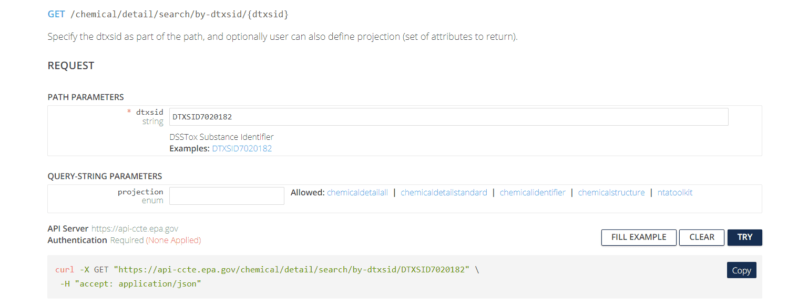

```{r, include = FALSE}
knitr::opts_chunk$set(
  collapse = TRUE,
  comment = "#>",
  eval = (nchar(Sys.getenv('CCTE_API_KEY')) > 0)
)
library(httptest)
start_vignette("1")
```


```{r setup}
if (!library(ccdR, logical.return = TRUE)){
  devtools::load_all()
}
```

```{r setup-print, echo = FALSE}
# Redefining the knit_print method to truncate character values to 25 characters
# in each column and to truncate the columns in the print call to prevent 
# wrapping tables with several columns.
#library(ccdR)
knit_print.data.table = function(x, ...) {
  y <- data.table::copy(x)
  y <- y[, lapply(.SD, function(t){
    if (is.character(t)){
      t <- strtrim(t, 25)
    }
    return(t)
  })]
  print(y, trunc.cols = TRUE)
}

registerS3method(
  "knit_print", "data.table", knit_print.data.table,
  envir = asNamespace("knitr")
)
```


## Introduction to CompTox Chemicals Dashboard

Accessing chemical data and wrangling it is a vital step in many types of workflows related to chemical, biological, and environmental modeling. While there are many resources available from which one can pull data, the [CompTox Chemicals Dashboard](https://comptox.epa.gov/dashboard/) built and maintained by the United States Environmental Protection Agency is particularly well-designed and suitable for these purposes. Originally introduced in [The CompTox Chemistry Dashboard: a community data resource for environmental chemistry](https://jcheminf.biomedcentral.com/articles/10.1186/s13321-017-0247-6), the CCD contains information on over 1.2 million chemicals as of December 2023. 

The CCD includes chemical information from many different domains, including physicochemical, environmental fate and transport, exposure, usage, in vivo toxicity, and in vitro bioassay data (Williams et al., 2017).

The CCD can be searched either one chemical at a time, or using a batch search.

### Searching one chemical at a time (single-substance search)

In single-substance search, the user types a full or partial chemical identifier (name, CASRN, InChiKey, or DSSTox ID) into a search box on the CCD homepage. Autocomplete provides a list of possible matches; the user selects one by clicking on it, and is then taken to the CCD page for that substance. Figure 1 shows an example: the CCD page for the chemical Bisphenol A. 

```{r, echo = FALSE, out.width= "90%", fig.align= 'center', fig.cap= "Fig 1: Bisphenol A landing page"}
knitr::include_graphics('./Pictures/CCD_BPA_page.png')
```


The different domains of data available for this chemical are shown by the tabs on the left side of the page: for example, "Physchem Prop." (physico-chemical properties), "Env. Fate/Transport" (environmental fate and transport data), and "Hazard Data" (*in vivo* hazard and toxicity data), among others. 

### Batch search

In batch search, the user enters a list of search inputs, separated by newlines, into a batch-search box on https://comptox.epa.gov/dashboard/batch-search . The user selects the type(s) of inputs by selecting one or more checkboxes – these may include chemical identifiers, monoisotopic masses, or molecular formulas. Then, the user selects “Display All Chemicals” to display the list of substances matching the batch-search inputs, or “Choose Export Options” to choose options for exporting the batch-search results as a spreadsheet. The exported spreadsheet may include data from most of the domains available on an individual substance’s CCD page.


```{r, echo = FALSE, out.width = "90%", fig.align = 'center', fig.cap="Fig 2: CCD Batch Search"}
knitr::include_graphics('./Pictures/CCD_Batch_Search.png')
```

The user can download the selected information in various formats, such as Excel (.xlsx), comma-separated values (.csv), or different types of chemical table files (.e.g, MOL). 

```{r, echo=FALSE, out.width="90%", fig.align='center', fig.cap='Fig 3: CCD Batch Search Customize Export'}
knitr::include_graphics('./Pictures/CCD_Batch_Search_customize_export_results.png')
```


The web interface for batch search only allows input of 10,000 identifiers at a time. If a user needs to retrieve information for more than 10,000 chemicals, they will need to separate their identifiers into multiple batches and search each one separately.

### Challenges of web-based dashboard search

Practicing researchers typically end up with a Dashboard workflow that looks something like this:

1.	Start with a dataset that includes your chemical identifiers of interest. These may include chemical names, Chemical Abstract Service Registry Numbers (CASRNs), Distributed Searchable Structure-Toxicity Database (DSSTox) identifiers, or InChIKeys.
2.	Export the chemical identifiers to a spreadsheet. Often, this is done by importing the data into an environment such as R or Python, in order to do some data wrangling (e.g., to select only the unique substance identfiers; to clean up improperly-formatted CASRNs; etc.). Then, the identifiers are saved in a spreadsheet (an Excel, .csv, or .txt file), one chemical identifier per row.
3.	Copy and paste the chemical identifiers from the spreadsheet into the CCD Batch Search box. If there are more than 10,000 total chemical identifiers, divide them into batches of 10,000 or less, and search each batch separately.
4.	Choose your desired export options on the CCD Batch Search page.
5.	Download the exported spreadsheet of CCD data. By default, the downloaded spreadsheet will be given a file name that includes the timestamp of the download.
6.	Repeat steps 3-5 for each batch of 10,000 identifiers produced in step 2. 
7.	Import the downloaded spreadsheet(s) of CCD data into the analysis tool you are using (e.g. R or Python).
8.	Merge the table(s) of downloaded CCD data with your original dataset of interest.
9.	Proceed with research-related data analysis using the chemical data downloaded from the CCD (e.g., statistical modeling, visualization, etc.)

Because each of these workflow steps requires manual interaction with the search and download process, the risk of human error inevitably creeps in. Here are a few real-world possibilities (the authors can neither confirm nor deny that they have personally committed any of these errors):

-	Researchers could copy/paste the wrong identifiers into the CCD batch search, especially if they have more than 10,000 identifiers and have to divide them into batches.
-	Chemical identifiers could be corrupted during the process of exporting to a spreadsheet. For example, if a researcher opens and resaves a CSV file using Microsoft Excel, any information that appears to be in date-like format will be automatically converted to a date (unless the researcher has the most recently-updated version of Excel and has selected the option in Settings that will stop Excel from auto-detecting dates). This behavior has long been identified as a problem in genomics, where gene names can appear date-like to Excel (Abeysooriya et al. 2021). It also affects cheminformatics, where chemical identifiers can appear date-like to Excel. For example, the valid CASRN “1990-07-4” would automatically be converted to “07/04/1990” (if Excel is set to use MM/DD/YYYY date formats). CCD batch search cannot recognize "07/04/1990" as a valid chemical identifier and will be unable to return any chemical data.
-	Researchers could accidentally rename a downloaded CCD data file to overwrite a previous download (for example, when searching multiple batches of identfiers). 
-	Researchers could mistakenly import the wrong CCD download file back into their analysis environment (for example, when searching multiple batches of identfiers). 

Moreover, the manual stages of this kind of workflow are also non-transparent and not easily reproducible. 

## CCTE's Application Programming Interfaces (APIs) for Automated Batch Search of the CCD


Recently, the [Center for Computational Toxicology and Exposure](https://www.epa.gov/aboutepa/about-center-computational-toxicology-and-exposure-ccte) (CCTE) developed a set of Application Programming Interfaces (APIs) that allows programmatic access to the CCD, bypassing the manual steps of the web-based batch search workflow. APIs effectively automate the process of accessing and downloading data from the web pages that make up the CCD. 


The [CCTE APIs](https://api-ccte.epa.gov/docs/) are publicly available at no cost to the user. However, in order to use the CCTE APIs, you must have an API key. The API key uniquely identifies you to the CCD servers and verifies that you have permission to access the database. Getting an API key is free, but requires contacting the API support team at [ccte_api@epa.gov](mailto:ccte_api@epa.gov).

The APIs are organized into three sets of "endpoints" (chemical data domains): `Chemical`, `Hazard`, and `Bioactivity`. Pictured below in Figure 4 is what the `Chemical` section looks like and can be found at [CCTE API Chemical Endpoints](https://api-ccte.epa.gov/docs/chemical.html).

```{r, echo = FALSE, out.width = "90%", fig.align='center', fig.cap="Fig 4: CCTE API Chemical Endpoints"}
knitr::include_graphics('./Pictures/CCTE_Chemical_API_endpoints.png')
```

The APIs can be explored through the pictured web interface at https://api-ccte.epa.gov/docs/chemical.html .

### CCTE API authentication

`Authentication` is the first tab on the left. Authentication is required to use the APIs. To authenticate yourself in the API web interface, input your unique API key.

```{r, echo = FALSE, out.width = "90%", fig.align='center', fig.cap="Fig 5: CCTE API Key Authentication"}
knitr::include_graphics("./Pictures/CCTE_API_Key_authentication.png")
```


### CCTE API endpoints


On the left of the API web interface, there are several different tabs, one for each endpoint in the `Chemical` domain. The endpoints are organized by the type of information provided. For instance, the `Chemical Details Resource` endpoint provides basic chemical information; the `Chemical Property Resource` endpoint provides more comprehensive physico-chemical property information; the `Chemical Fate Resource` endpoint provides chemical fate and transport information; and so on. 


### Constructing CCTE API requests

As mentioned above, APIs effectively automate the process of accessing and downloading data from the web pages that make up the CCD. APIs do this by automatically constructing requests using the Hypertext Transfer Protocol (HTTP) that enables communication between clients (e.g. your computer) and servers (e.g. the CCD).

In the CCTE API web interface, the colored boxes next to each endpoint indicate the type of the associated HTTP method: either a GET request ("GET", blue) or a a POST request ("POS", green). GET is used to request data from a specific web resource (e.g. a specific URL); POST is used to send data to a server to create or update a web resource. For the CCTE APIs, POST requests are used to perform multiple (batch) searches in a single API call; GET requests are used for non-batch searches. You do not need to understand the details of POST and GET requests in order to use the API.

Click on the second item under `Chemical Details Resource`, the tab labeled `Get data by dtxsid`. The following page will appear.

```{r, echo = FALSE, out.width = "90%", fig.align='center', fig.cap="Fig 6: CCTE Get Details by DTXSID"}

```


This page has two subheadings: "Path Parameters" and "Query-String Parameters". "Path Parameters" contains user-specified parameters that are required in order to tell the API what URL (web address) to access. In this case, the required parameter is a string for the DTXSID identifying the chemical to be searched.

"Query-String Parameters" contain user-specific parameters (usually optional) that tell the API what specific type(s) of information to download from the specified URL. In this case, the optional parameter is a `projection` parameter, a string that can take one of five values (`chemicaldetailall`, `chemicaldetailstandard`, `chemicalidentifier`, `chemicalstructure`, `ntatoolkit`). Depending on the value of this string, the API can return different sets of information about the chemical. If the `projection` parameter is left blank, then a default set of chemical information is returned.

The default return format is displayed below and includes a variety of fields with data types represented.

```{r, echo = FALSE, out.width = "90%", fig.align='center', fig.cap= "Fig 7: CCTE Get Details by DTXSID data types"}
knitr::include_graphics("./Pictures/Get_Data_by_DTXSID_BOTTOM.png")
```


We show what returned data from searching Bisphenol A looks like using this endpoint with the `chemicaldetailstandard` value for `projection` selected.

```{r, echo = FALSE, out.width = "90%", fig.align='center', fig.cap="Fig 8: Bisphenol A output"}
knitr::include_graphics("./Pictures/BPA_chemicaldetailstandard.png")
```


Formatting an http request is not necessarily intuitive nor worth the time for someone not already familiar with the process, so these endpoints may provide a resource that for many would require a significant investment in time and energy to learn how to use. However, there is a solution to this in the form of the R package *ccdR*.

*ccdR* was developed to streamline the process of accessing the information available through the CCTE APIs without requiring prior knowledge of how to use APIs. As an example, we demonstrate the ease with which one may retrieve the information given by this endpoint for Bisphenol A using the *ccdR* approach and contrast it with the approach using the CCD website or CCTE `Chemical` Endpoint website.


## API key

Before getting started, a user must have an API key ready to use in order to access the CCTE APIs. This can be obtained from the admins of the CCTE APIs by emailing [CCTE API Admins](mailto:ccte_api@epa.gov). In this vignette, the key will be stored as the variable `my_key`. We will also demonstrate how to store the key in a single session or across sessions and how to access the key.

First, we store the api key in the variable `my_key`.

```{r, echo = FALSE}
my_key <- ccte_key()
```


```{r, eval = FALSE, api-key}
my_key <- 'YOUR_CCTE_API_key'
```

For general use of the package, one may use the function `register_ccdr()` to store the API key in the current session or more permanently for access across sessions. The following example demonstrates this.

```{r, register-ccte, eval=FALSE}
# This stores the key in the current session
register_ccdr(key = '<YOUR API KEY>')

# This stores the key across multiple sessions and only needs to be run once. If the key changes, rerun this with the new key.
register_ccdr(key = '<YOUR API KEY>', write = TRUE)
```

The API key is stored and the default display setting is turned off for protection. To change this, use the following functions as demonstrated.

```{r, display-hide-key}
# To show the API key
ccdr_show_api_key()
getOption('ccdr')$display_api_key

# To hide the API key
ccdr_hide_api_key()
getOption('ccdr')$display_api_key
```

Finally, to access the key, use the `ccte_key()` function.

```{r, ccte-key, eval = FALSE}
ccte_key()
```


## Chemical APIs

The CCTE APIs are split into three sections, the first of which is [Chemical APIs](https://api-ccte.epa.gov/docs/chemical.html#/). In the next few code chunks, we demonstrate how to use functions from ccdR to access different types of chemical information.

### Chemical Details Resource

The first function we explore is `get_chemical_details()`, which takes in either the DTXSID or DTXCID of a chemical and the user-specific API key. We obtain the relevant chemical details for Bisphenol A (BPA), which has DTXSID "DTXSID7020182".

```{r, bpa-chem-details}
bpa_details <- get_chemical_details(DTXSID = 'DTXSID7020182',
                                    API_key = my_key)
bpa_details <- data.table::as.data.table(bpa_details)
head(bpa_details)
```
The output of this function is a data.table. We could have also input the DTXCID rather than the DTXSID and returned the same data.

### Chemical Property Resource

The function `get_chem_info()` is similar. This returns phys-chem properties, which can be filtered to 'experimental' or 'predicted' if desired.


First, we grab all results. 

```{r, bpa-chem-info}
bpa_info <- get_chem_info(DTXSID = "DTXSID7020182",
                          API_key = my_key)
bpa_info <- data.table::as.data.table(bpa_info)

head(bpa_info)
```

Next, we filter by experimental results.

```{r, bpa-experimental}
bpa_info_experimental <- get_chem_info(DTXSID = "DTXSID7020182",
                                       type = 'experimental',
                                       API_key = my_key)
bpa_info_experimental <- data.table::as.data.table(bpa_info_experimental)

head(bpa_info_experimental)
```

For a more comprehensive treatment of the chemical endpoints, please see the 'Chemical' vignette that explores more of the ccdR functions related to the associated chemical endpoints.

## Hazard APIs

Next, we explore the hazard APIs. We first demonstrate how to access human or ecological toxicity data for a given chemical. One can specify the chemical in question through the DTXSID.

### Hazard Resource

We first grab all such hazard data.

```{r, hazard}
bpa_hazard <- get_hazard_by_dtxsid(DTXSID = 'DTXSID7020182',
                                   API_key = my_key)
bpa_hazard <- data.table::as.data.table(bpa_hazard)
head(bpa_hazard)
```

Then we focus on human hazard data.

```{r, human-hazard}
bpa_human_hazard <- get_human_hazard_by_dtxsid(DTXSID = 'DTXSID7020182',
                                               API_key = my_key)
bpa_human_hazard <- data.table::as.data.table(bpa_human_hazard)
head(bpa_human_hazard)
```

And finally we focus on ecotox hazard data.

```{r, ecotox-hazard}
bpa_eco_hazard <- get_ecotox_hazard_by_dtxsid(DTXSID = 'DTXSID7020182',
                                              API_key = my_key)
bpa_eco_hazard <- data.table::as.data.table(bpa_eco_hazard)
head(bpa_eco_hazard)
```

For more examples, please refer to the 'Hazard' vignette.

## Bioactivity APIs

The last set of APIs allow the user to access bioactivity information for a given chemical DTXSID or AEID.

### Bioactivity Resource

We first demonstrate obtaining bioactivity data based on an input DTXSID.

```{r, bioactivity-dtxsid}
bpa_bioactivity <- get_bioactivity_details(DTXSID = 'DTXSID7020182',
                                           API_key = my_key)

bpa_bioactivity <- data.table::as.data.table(bpa_bioactivity)
head(bpa_bioactivity)
```

If instead we want to search by assay id, we can do so using the same function.

```{r, bioactivity-aeid}
assay_id_search <- get_bioactivity_details(AEID = 42,
                                           API_key = my_key)
assay_id_search <- data.table::as.data.table(assay_id_search)
head(assay_id_search)
```

Again, for more information please refer to the 'Bioactivity' vignette.

## Conclusion

The ccdR package provides a streamlined approach to accessing data from the CCD for users with little or no prior experience using APIs. The functionality can be used within a variety of workflows that require data found on the CCD. To explore more examples of the various endpoints and functionality provided by the ccdR package, please refer to the 'Chemical-endpoints', 'Hazard', or 'Bioactivity' vignettes.

```{r breakdown, echo = FALSE, results = 'hide'}
# This chunk will be hidden in the final product. It serves to undo defining the
# custom print function to prevent unexpected behavior after this module during
# the final knitting process

knit_print.data.table = knitr::normal_print
  
registerS3method(
  "knit_print", "data.table", knit_print.data.table,
  envir = asNamespace("knitr")
)
```

```{r, include=FALSE}
end_vignette()
```
